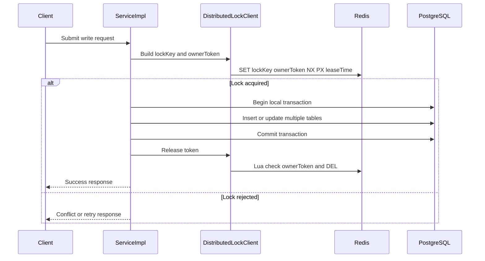
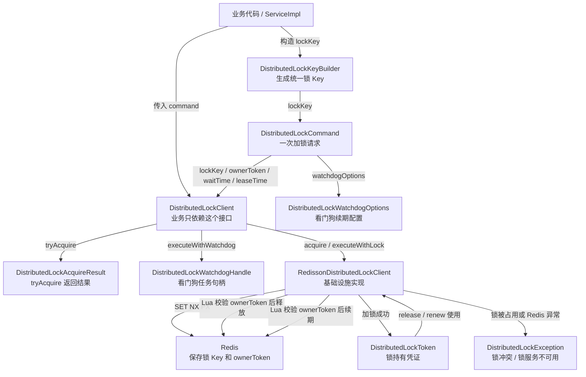
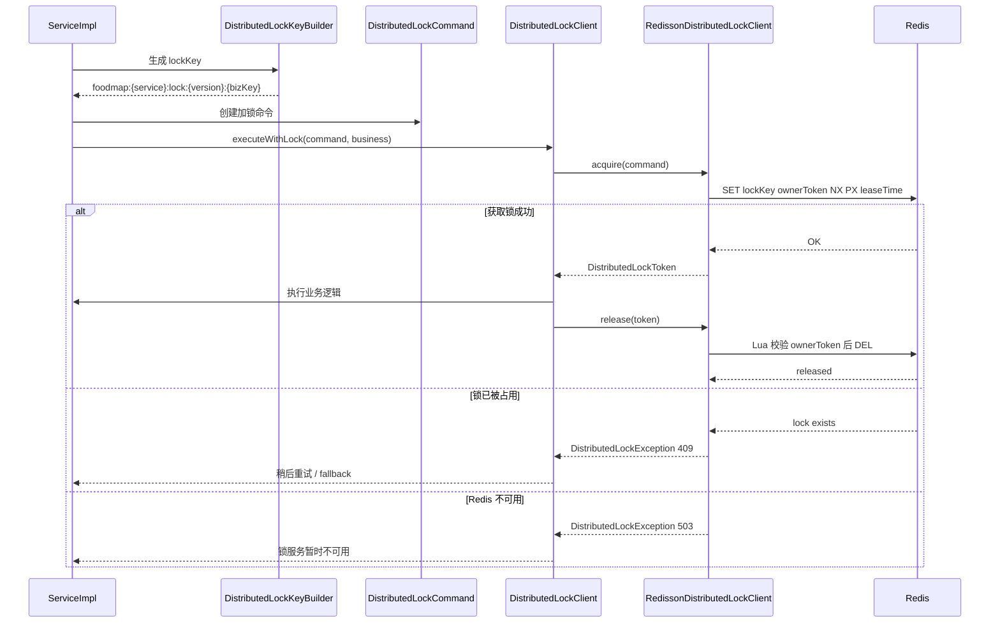
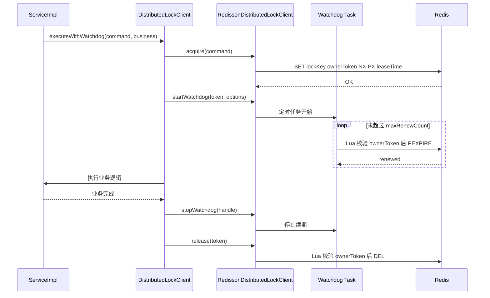
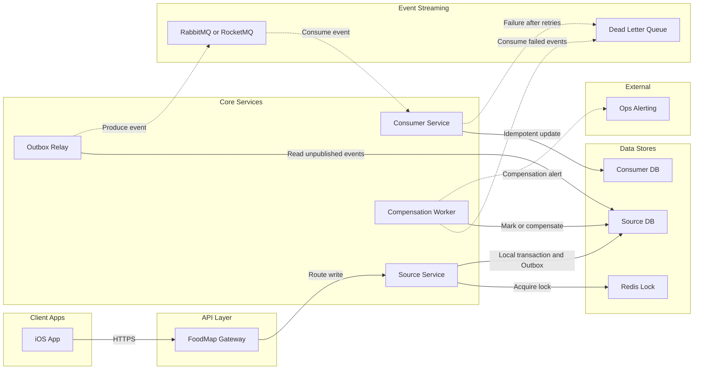
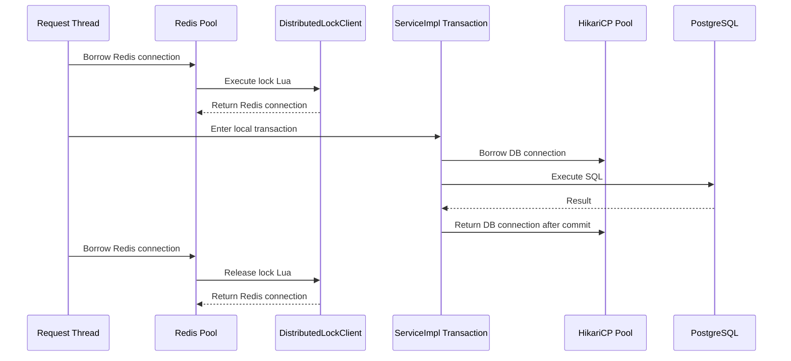
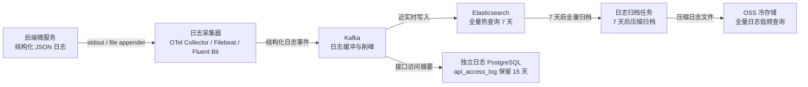

# CODEX 后端架构文档

## 1. 文档目的

本文档用于定义 FoodMap 的后端架构。

后端必须采用 Java 微服务模式开发。每个微服务拥有独立数据库。任何服务都不能直接读取或写入其他服务的数据库。

后续所有后端代码都必须根据本文档生成。如果服务边界、数据库归属、API 契约或基础设施选型发生变化，必须在修改代码之前或同时更新本文档。

## 2. 后端架构方向

架构形式：

- 微服务
- Java 后端
- 每个服务独立数据库
- API 网关作为外部统一入口
- 同步调用用于实时查询
- 异步事件用于统计、通知和最终一致性

核心规则：

1. 一个服务负责一个清晰的业务边界。
2. 一个服务拥有自己的数据库。
3. 服务之间不能共享数据表。
4. 服务之间通过 API 或事件通信。
5. 后端必须强制校验所有可见权限和资源归属。
6. 只有 PUBLIC 推荐内容进入全站社区统计。

## 3. 推荐技术栈

| 层级 | 技术 |
| --- | --- |
| 开发语言 | Java 21 |
| 基础框架 | Spring Boot |
| 微服务体系 | Spring Cloud / Spring Cloud Alibaba |
| API 网关 | Spring Cloud Gateway |
| 注册中心 | Nacos |
| 配置中心 | Nacos |
| 认证鉴权 | Spring Security + JWT |
| ORM | MyBatis + Mapper.xml |
| 数据库 | PostgreSQL |
| 地理数据库 | PostgreSQL + PostGIS |
| 数据库连接池 | HikariCP |
| 缓存 | Redis |
| 分布式锁适配器 | Redisson，限定在 `DistributedLockClient` 基础设施实现内使用 |
| 消息队列 | RocketMQ 或 RabbitMQ |
| 对象存储 | MinIO 或阿里云 OSS |
| API 文档 | OpenAPI + Knife4j |
| 构建工具 | Maven |
| 容器化 | Docker |
| 本地开发 | Docker Compose / OrbStack / Spring Profiles |
| 监控 | Spring Boot Actuator、Prometheus、Grafana |
| 链路追踪 | OpenTelemetry 或 SkyWalking |
| 日志热查询 | Elasticsearch |
| 日志缓冲管道 | Kafka，当前阶段引入；业务消息队列不与日志 Kafka 混用 |
| 日志采集 | OpenTelemetry Collector / Filebeat / Fluent Bit，按部署阶段选择 |
| 日志归档 | OSS 冷存储 + 独立日志 PostgreSQL 接口摘要 |

优先推荐的国内生态组合：

- Spring Boot
- Spring Cloud Alibaba
- Nacos
- RocketMQ
- Redis
- PostgreSQL/PostGIS
- MinIO 或阿里云 OSS

## 4. 微服务列表

```text
foodmap-platform
├── foodmap-gateway-service
├── foodmap-auth-service
├── foodmap-user-service
├── foodmap-relation-service
├── foodmap-store-service
├── foodmap-recommendation-service
├── foodmap-community-service
├── foodmap-media-service
├── foodmap-notification-service
└── foodmap-admin-service
```

MVP 阶段服务：

```text
foodmap-gateway-service
foodmap-auth-service
foodmap-user-service
foodmap-relation-service
foodmap-store-service
foodmap-recommendation-service
foodmap-community-service
foodmap-media-service
```

后续服务：

```text
foodmap-notification-service
foodmap-admin-service
```

## 5. 服务职责

### 5.1 网关服务

服务名：

```text
foodmap-gateway-service
```

职责：

- 外部 API 统一入口。
- 将请求路由到内部微服务。
- 通过 Spring Cloud LoadBalancer 解析 `lb://service-name` 路由。
- 在合适场景下进行 JWT 前置校验。
- 限流。
- 请求日志。
- CORS。
- API 版本路由。

数据库：

- 默认无数据库。

依赖：

- 如果后续使用不透明 Token，可依赖认证服务校验 Token。
- 依赖 Nacos 进行服务发现。
- 依赖 Spring Cloud LoadBalancer 完成服务实例选择。

### 5.2 认证服务

服务名：

```text
foodmap-auth-service
```

职责：

- 注册账号。
- 支持手机号、邮箱、账号名登录。
- 密码校验。
- 密码哈希。
- 签发 Access Token。
- 签发和撤销 Refresh Token。
- 登录日志。

数据库：

```text
foodmap_auth_db
```

核心表：

```text
auth_accounts
auth_credentials
refresh_tokens
login_logs
```

不负责：

- 用户资料。
- 好友关系。
- 推荐内容。

### 5.3 用户服务

服务名：

```text
foodmap-user-service
```

职责：

- 用户资料。
- 昵称。
- 头像。
- 城市。
- 简介。
- 用户设置。
- 用户状态。
- 根据对外可搜索字段搜索用户。

数据库：

```text
foodmap_user_db
```

核心表：

```text
users
user_profiles
user_settings
```

### 5.4 关系服务

服务名：

```text
foodmap-relation-service
```

职责：

- 好友申请。
- 好友关系。
- 情侣绑定申请。
- 当前有效情侣关系。
- 后续支持群组创建和成员管理。
- 拉黑用户。
- 关系权限校验。

数据库：

```text
foodmap_relation_db
```

核心表：

```text
friend_requests
friend_relations
couple_requests
couple_relations
groups
group_members
blocked_users
```

关键内部接口：

```text
GET /internal/relations/friends/check
GET /internal/relations/couple/check
GET /internal/relations/groups/{groupId}/members/check
```

### 5.5 门店服务

服务名：

```text
foodmap-store-service
```

职责：

- 集成高德 POI 搜索。
- 创建门店。
- 手动创建门店。
- 查询门店详情。
- 处理门店别名。
- 记录门店合并。
- 地图视野内门店查询。
- 地理索引。

数据库：

```text
foodmap_store_db
```

数据库类型：

```text
PostgreSQL + PostGIS
```

核心表：

```text
stores
store_pois
store_aliases
store_merge_records
```

重要原则：

门店服务拥有门店位置和 POI 标识。推荐服务只通过 storeId 引用门店，不存储完整门店详情。

### 5.6 推荐服务

服务名：

```text
foodmap-recommendation-service
```

职责：

- 创建推荐菜单。
- 编辑推荐菜单。
- 删除推荐菜单。
- 菜名必须以纯文字保存。
- 保存可选推荐理由、价格、推荐程度。
- 管理推荐标签。
- 管理推荐图片引用。
- 管理推荐评论。
- 管理评论图片引用。
- 管理可见规则。
- 查询当前用户可见的推荐内容。
- 发送推荐相关领域事件。

数据库：

```text
foodmap_recommendation_db
```

核心表：

```text
recommendations
recommendation_images
recommendation_comments
recommendation_comment_images
tags
recommendation_tags
visibility_rules
```

可见范围：

```text
PRIVATE
SPECIFIC_USERS
FRIENDS
COUPLE
GROUP
PUBLIC
```

外部依赖：

- 调用关系服务进行关系校验。
- 调用门店服务校验门店是否存在。
- 调用媒体服务校验图片。
- 通过消息队列发送领域事件。

重要原则：

推荐服务是推荐内容可见范围的事实来源。

### 5.7 社区服务

服务名：

```text
foodmap-community-service
```

职责：

- 消费推荐事件。
- 维护公开门店统计。
- 维护公开菜品统计。
- 维护附近公开推荐索引。
- 提供热门门店接口。
- 提供热门菜品接口。
- 提供公开社区列表。

数据库：

```text
foodmap_community_db
```

核心表：

```text
public_store_stats
public_dish_stats
public_recommendation_index
community_feed_items
```

缓存：

- Redis 用于热门列表和附近公开结果缓存。

重要原则：

社区服务只能统计可见范围为 PUBLIC 的推荐内容。

### 5.8 媒体服务

服务名：

```text
foodmap-media-service
```

职责：

- 生成上传凭证。
- MVP 如有需要可接收后端直传。
- 校验图片类型和大小。
- 保存媒体元数据。
- 管理媒体使用引用。
- 支持推荐图片和评论图片的引用校验。
- 返回公开 URL 或签名 URL。

数据库：

```text
foodmap_media_db
```

核心表：

```text
media_files
media_usage_refs
```

对象存储：

```text
MinIO 或阿里云 OSS
```

### 5.9 通知服务

服务名：

```text
foodmap-notification-service
```

阶段：

- 后续实现

职责：

- 好友申请通知。
- 情侣绑定通知。
- 群组邀请通知。
- 系统通知。

数据库：

```text
foodmap_notification_db
```

### 5.10 管理后台服务

服务名：

```text
foodmap-admin-service
```

阶段：

- 后续实现

职责：

- 公开内容审核。
- 举报处理。
- 门店合并操作。
- 用户状态管理。

数据库：

```text
foodmap_admin_db
```

## 6. 数据库归属

| 服务 | 数据库 | 主要数据 |
| --- | --- | --- |
| 认证服务 | foodmap_auth_db | 凭证、Token、登录日志 |
| 用户服务 | foodmap_user_db | 用户资料和设置 |
| 关系服务 | foodmap_relation_db | 好友、情侣、群组、拉黑 |
| 门店服务 | foodmap_store_db | 门店、POI、地理数据 |
| 推荐服务 | foodmap_recommendation_db | 推荐、标签、可见范围 |
| 社区服务 | foodmap_community_db | 公开统计和索引 |
| 媒体服务 | foodmap_media_db | 媒体元数据 |
| 通知服务 | foodmap_notification_db | 通知 |
| 管理服务 | foodmap_admin_db | 举报和审核 |

数据库规则：

任何服务都不能跨服务访问数据表。

示例：

- 推荐服务不能直接查询 friend_relations 表。
- 推荐服务必须调用关系服务。

### 6.1 库表设计通用规则

后续所有数据库表、Flyway 脚本、Entity、Mapper 和 DTO 必须遵守以下规则。

#### 6.1.1 数据库边界

- 每个微服务拥有独立数据库。
- 服务之间不能跨库访问数据表。
- 服务之间的数据交互只能通过内部 API 或 MQ 事件完成。
- 本地开发可以使用一个 PostgreSQL/PostGIS 容器创建多个逻辑数据库，但仍必须保持服务数据库边界。

#### 6.1.2 持久化对象、DTO 和 VO 分层

- 数据库结构对应的 Java 类统一称为持久化实体，必须放在各服务的 `infrastructure.persistence.entity` 包中。
- 持久化实体只表达数据库表结构和持久化映射，不允许作为 Controller 请求体、响应体或前端展示模型直接暴露。
- 每张业务表的每个字段都必须在数据库结构文档中提供中文注释，说明字段业务含义、使用场景和排查价值。
- Flyway 建表脚本必须为每张表生成 `comment on table`，并为每个字段生成 `comment on column`；禁止新增无中文注释的表字段。
- 持久化实体的每个字段都必须提供字段级 Javadoc 注释；如果字段对应数据库表字段，Javadoc 必须与数据库字段中文注释一一对应。
- 所有业务表固定字段 `id / created_time / updated_time / is_delete` 由 `foodmap-common` 中的 `BaseEntity` 承载。
- `BaseEntity` 只承载固定字段，不承载 `user_id`、`account_id`、`store_id` 等业务主键。
- DTO 用于后端 HTTP/API 入参和响应，必须放在各服务的 `dto` 包中。
- VO 用于前端展示或后续 BFF 展示聚合，必须与 DTO、持久化实体分离。
- Entity、DTO、VO 之间通过 service 层或专门转换方法显式转换，禁止在 Controller 中直接返回 Entity。
- service 层必须使用 `XxxService` 接口 + `XxxServiceImpl` 实现类，Controller 只能依赖 `XxxService` 接口。
- ServiceImpl 只能依赖仓储端口接口，不能直接依赖内存仓储、MyBatis Mapper 等基础设施实现。
- 内存仓储只用于单元测试或本地替身，不允许作为生产 profile 的默认持久化实现。
- 运行时数据库访问统一使用 MyBatis Mapper + Mapper.xml，基础设施实现放在 `infrastructure.persistence.mybatis` 包中。

#### 6.1.3 MyBatis 数据访问标准

FoodMap 后端统一使用 MyBatis Mapper + Mapper.xml 作为数据库访问实现。项目不直接依赖 MyBatis-Plus 的自动 CRUD 作为运行时标准，但允许在项目内建设类似 MyBatis-Plus 的代码生成模板。

分层调用链必须保持：

```text
Controller -> XxxService -> XxxServiceImpl -> Repository Port -> Repository Impl -> Mapper -> Mapper.xml
```

目录约定：

```text
infrastructure
└── persistence
    ├── entity
    ├── mapper
    │   ├── AuthAccountMapper.java
    │   ├── AuthAccountDefineMapper.java
    │   └── xml
    │       ├── AuthAccountMapper.xml
    │       └── AuthAccountDefineMapper.xml
    └── mybatis
        └── AuthAccountRepositoryImpl.java
```

命名规则：

- 标准单表 Mapper 使用 `{EntityName}Mapper.java` 和 `{EntityName}Mapper.xml`。
- 自定义复杂 SQL Mapper 使用 `{EntityName}DefineMapper.java` 和 `{EntityName}DefineMapper.xml`。
- `{EntityName}` 使用表语义的单数 PascalCase，例如 `auth_accounts` 对应 `AuthAccountEntity`、`AuthAccountMapper`、`AuthAccountDefineMapper`。
- Repository 实现类名禁止使用 `MyBatis`、`Jdbc`、`Redis` 等技术前缀，避免业务阅读路径被基础设施细节打断。
- Repository 实现使用 `{EntityName}RepositoryImpl` 或按业务聚合语义命名，例如 `AuthAccountRepositoryImpl`、`UserRepositoryImpl`。
- 技术实现差异通过包名和注释表达，例如 MyBatis 实现放在 `infrastructure.persistence.mybatis` 包中，而不是写进 Repository 类名前缀。

标准 Mapper 由数据库表结构生成，只允许承载单表模板 SQL：

- `selectById`，按数据库内部主键查询，默认过滤 `is_delete = 0`。
- `selectByBizId`，按业务主键查询，默认过滤 `is_delete = 0`。
- `selectListByCondition`，有限动态条件查询。
- `selectPageByCondition`，有限动态条件分页查询。
- `insertOne`，单条新增。
- `insertBatch`，批量新增。
- `updateById`，按数据库内部主键单条编辑。
- `updateByBizId`，按业务主键单条编辑。
- `updateBatchByBizId`，按业务主键批量编辑。
- `logicDeleteById`，按数据库内部主键逻辑删除。
- `logicDeleteByBizIds`，按业务主键批量逻辑删除。

标准动态查询只允许支持以下安全范围：

- 等值查询。
- 字符串模糊查询。
- 时间范围查询。
- 枚举或状态字段查询。
- `is_delete = 0` 默认过滤。
- 分页参数。
- 后端白名单控制的排序字段。

以下 SQL 必须放入 DefineMapper，不能塞入标准 Mapper：

- 跨表关联查询。
- 可见范围、权限、归属判断。
- 地图边界框、距离、PostGIS 查询。
- 聚合统计、排行榜、社区 feed 查询。
- 动态条件复杂到影响可读性的业务查询。
- 需要加锁、幂等校验或特殊索引提示的 SQL。

生成和维护规则：

- Flyway 表结构确定后，必须同步生成或更新 Entity、标准 Mapper、标准 Mapper.xml、Repository 实现。
- Flyway 字段中文注释、`CODEX-after.md` 表字段中文注释和 Entity 字段 Javadoc 必须保持一致。
- 标准 Mapper 和 XML 应尽量保持可重复生成，人工业务 SQL 不得写入标准 XML。
- 自定义 SQL 只写入 DefineMapper 和 DefineMapper.xml，避免重新生成标准 Mapper 时覆盖业务 SQL。
- Mapper 不能被 Controller、XxxService 或 XxxServiceImpl 直接调用，只能由 Repository Impl 调用。
- Mapper XML 中禁止直接拼接前端传入的排序字段、表名、列名；必须使用后端白名单转换。
- 删除默认使用逻辑删除，禁止标准 Mapper 生成物理删除 SQL。

#### 6.1.4 固定字段

每张业务表必须包含以下固定字段：

```text
id
created_time
updated_time
is_delete
```

字段定义：

```sql
id bigint generated by default as identity primary key,
created_time timestamptz not null,
updated_time timestamptz not null,
is_delete smallint not null default 0
```

字段含义：

- `id`：数据库内部自增主键，只用于本服务数据库内部。
- `created_time`：创建时间，暂定由业务层或 ORM 统一传入。
- `updated_time`：更新时间，暂定由业务层或 ORM 统一传入。
- `is_delete`：逻辑删除标记，`0` 表示未删除，`1` 表示已删除，默认 `0`。

查询业务数据时默认必须过滤：

```sql
is_delete = 0
```

#### 6.1.5 业务主键

主业务表必须保留 `bigint` 类型业务主键，并设置唯一约束。

示例：

```text
auth_accounts.account_id
users.user_id
friend_relations.relation_id
groups.group_id
stores.store_id
recommendations.recommendation_id
tags.tag_id
media_files.media_id
```

业务主键规则：

- 业务主键用于 API、跨服务引用、日志、事件和前端展示。
- 自增主键 `id` 不对外暴露，不用于跨服务引用。
- 跨服务引用只能保存对方服务的业务主键，例如推荐服务保存 `user_id` 和 `store_id`。
- 业务主键不得使用服务内存计数器生成，避免服务重启后与数据库已有数据重复。
- 当前 PostgreSQL 持久化服务可优先使用 Flyway 管理的数据库 sequence 生成业务主键。
- 后续跨库、跨实例规模扩大后，可演进为统一 ID 服务或 Snowflake 风格的 `bigint` ID。

中间表不强制要求独立业务主键，但必须具备必要的唯一约束。

示例：

```sql
unique (recommendation_id, tag_id)
unique (group_id, user_id)
```

#### 6.1.4 唯一索引与逻辑删除

如果某个唯一字段在逻辑删除后允许再次创建，应优先使用 PostgreSQL 部分唯一索引。

示例：

```sql
create unique index uk_users_user_id_active
on users (user_id)
where is_delete = 0;
```

如果业务要求历史数据中该字段永久不可重复，则可以使用普通唯一约束。

#### 6.1.5 金额字段

FoodMap 当前阶段的价格字段是推荐展示信息，不是支付结算金额。

推荐菜品价格、人均价格等展示型金额使用：

```sql
numeric(10,2)
```

Java 类型使用：

```text
BigDecimal
```

示例：

```text
price_amount numeric(10,2)
avg_price_amount numeric(10,2)
```

如果后续出现订单、钱包、支付、退款、余额等真实交易金额，再使用 `bigint` 保存最小货币单位。

示例：

```text
amount_cent bigint
```

#### 6.1.6 地理字段

门店服务是地理位置事实来源。门店位置字段建议同时保留经纬度和 PostGIS 字段：

```sql
longitude numeric(10,7),
latitude numeric(10,7),
location geography(Point, 4326)
```

地图范围查询和附近查询必须优先使用 `location` 的地理索引。

#### 6.1.7 枚举、命名和敏感字段

- 表名和字段名统一使用 `snake_case`。
- 枚举字段早期优先使用 `varchar(32)` 保存明确字符串，如 `PUBLIC`、`PRIVATE`、`ACTIVE`。
- 密码、Token、密钥等敏感数据不能明文保存。
- 密码必须保存为 `password_hash`，必要时保存 `hash_algorithm`。

#### 6.1.8 数据库迁移

数据库结构必须通过 Flyway 管理。

每个服务拥有自己的迁移目录：

```text
src/main/resources/db/migration
```

迁移文件命名示例：

```text
V1__create_auth_tables.sql
V2__add_login_logs.sql
```

禁止通过手工 SQL 变更数据库后不提交迁移脚本。

### 6.2 MVP 首批表结构草案

本节定义 MVP 阶段优先落地的数据库表结构草案。后续生成 Flyway 脚本、Entity、Mapper、DTO 和 API 契约时，必须以本节为基础。

本节暂不直接等同于最终 SQL。正式建表前仍需要根据接口实现、索引策略和测试结果补充约束、索引、外键策略或字段长度。

#### 6.2.1 通用固定字段

下列所有业务表都必须包含固定字段。

| 字段名 | 推荐类型 | 中文注释 |
| --- | --- | --- |
| id | bigint generated by default as identity primary key | 数据库内部自增主键，仅用于本服务库内关联和 ORM 标识，不对外暴露 |
| created_time | timestamptz not null | 数据创建时间，暂定由业务层或 ORM 统一写入 |
| updated_time | timestamptz not null | 数据最后更新时间，暂定由业务层或 ORM 统一写入 |
| is_delete | smallint not null default 0 | 逻辑删除标记，0 表示未删除，1 表示已删除 |

#### 6.2.2 认证服务表结构

数据库：

```text
foodmap_auth_db
```

表：`auth_accounts`

中文名：认证账号表。

用途：保存登录账号的基础认证身份，负责账号状态、登录标识和与用户服务的 `user_id` 关联。

| 字段名 | 推荐类型 | 中文注释 |
| --- | --- | --- |
| account_id | bigint not null | 账号业务主键，用于认证服务对外引用账号 |
| user_id | bigint not null | 用户业务主键，关联用户服务的用户身份 |
| account_name | varchar(64) | 账号名，可用于账号名登录 |
| phone | varchar(32) | 手机号，可用于手机号登录 |
| email | varchar(128) | 邮箱，可用于邮箱登录 |
| account_status | varchar(32) not null | 账号状态，如 NORMAL、DISABLED、LOCKED |
| registered_channel | varchar(32) | 注册来源，如 IOS、WEB、ADMIN |
| last_login_time | timestamptz | 最近一次登录成功时间 |

表：`auth_credentials`

中文名：认证凭证表。

用途：保存账号的登录凭证。MVP 阶段主要保存密码哈希，后续可扩展验证码、第三方登录等凭证类型。

| 字段名 | 推荐类型 | 中文注释 |
| --- | --- | --- |
| credential_id | bigint not null | 凭证业务主键 |
| account_id | bigint not null | 账号业务主键，关联 auth_accounts.account_id |
| credential_type | varchar(32) not null | 凭证类型，如 PASSWORD |
| password_hash | varchar(255) | 密码哈希值，禁止保存明文密码 |
| hash_algorithm | varchar(64) | 密码哈希算法标识，如 PBKDF2WithHmacSHA256 |

表：`refresh_tokens`

中文名：刷新令牌表。

用途：保存 Refresh Token 的哈希、过期和撤销状态，用于刷新 Access Token 和主动退出登录。

| 字段名 | 推荐类型 | 中文注释 |
| --- | --- | --- |
| token_id | bigint not null | 刷新令牌业务主键 |
| account_id | bigint not null | 账号业务主键，关联 auth_accounts.account_id |
| token_hash | varchar(255) not null | Refresh Token 哈希值，禁止保存明文 Token |
| expires_time | timestamptz not null | Refresh Token 过期时间 |
| revoked_time | timestamptz | Refresh Token 被撤销时间 |
| token_status | varchar(32) not null | Token 状态，如 ACTIVE、REVOKED、EXPIRED |

表：`login_logs`

中文名：登录日志表。

用途：记录登录行为，用于安全审计、异常登录分析和用户最近登录记录。

| 字段名 | 推荐类型 | 中文注释 |
| --- | --- | --- |
| login_log_id | bigint not null | 登录日志业务主键 |
| account_id | bigint | 账号业务主键，登录失败且账号不存在时可为空 |
| login_type | varchar(32) not null | 登录方式，如 PHONE、EMAIL、ACCOUNT_NAME |
| login_result | varchar(32) not null | 登录结果，如 SUCCESS、FAILED |
| ip_address | varchar(64) | 登录请求 IP 地址 |
| user_agent | varchar(512) | 登录设备或浏览器 User-Agent |

#### 6.2.3 用户服务表结构

数据库：

```text
foodmap_user_db
```

表：`users`

中文名：用户主表。

用途：保存用户核心身份、昵称、头像和账号状态，是用户服务的主事实表。

| 字段名 | 推荐类型 | 中文注释 |
| --- | --- | --- |
| user_id | bigint not null | 用户业务主键，用于跨服务引用用户 |
| account_id | bigint not null | 认证账号业务主键，来源于认证服务 |
| nickname | varchar(64) not null | 用户昵称 |
| avatar_media_id | bigint | 头像媒体业务主键，关联媒体服务 media_id |
| user_status | varchar(32) not null | 用户状态，如 NORMAL、DISABLED |
| searchable | smallint not null default 1 | 是否允许被搜索，1 表示允许，0 表示不允许 |

表：`user_profiles`

中文名：用户资料表。

用途：保存用户展示资料，避免用户主表承载过多非核心字段。

| 字段名 | 推荐类型 | 中文注释 |
| --- | --- | --- |
| profile_id | bigint not null | 用户资料业务主键 |
| user_id | bigint not null | 用户业务主键，关联 users.user_id |
| city_code | varchar(32) | 用户所在城市编码 |
| city_name | varchar(64) | 用户所在城市名称 |
| bio | varchar(255) | 用户个人简介 |
| gender | varchar(32) | 性别，可选字段 |
| birthday | date | 生日，可选字段 |

表：`user_settings`

中文名：用户设置表。

用途：保存隐私偏好和默认推荐可见范围。

| 字段名 | 推荐类型 | 中文注释 |
| --- | --- | --- |
| setting_id | bigint not null | 用户设置业务主键 |
| user_id | bigint not null | 用户业务主键，关联 users.user_id |
| default_visibility_type | varchar(32) not null | 默认推荐可见范围，如 PRIVATE、FRIENDS、PUBLIC |
| allow_friend_request | smallint not null default 1 | 是否允许收到好友申请，1 表示允许，0 表示不允许 |
| allow_search_by_phone | smallint not null default 0 | 是否允许通过手机号搜索到本人 |
| allow_search_by_email | smallint not null default 0 | 是否允许通过邮箱搜索到本人 |

#### 6.2.4 关系服务表结构

数据库：

```text
foodmap_relation_db
```

表：`friend_requests`

中文名：好友申请表。

用途：保存好友申请流程和处理结果。

| 字段名 | 推荐类型 | 中文注释 |
| --- | --- | --- |
| request_id | bigint not null | 好友申请业务主键 |
| from_user_id | bigint not null | 发起申请的用户业务主键 |
| to_user_id | bigint not null | 接收申请的用户业务主键 |
| request_message | varchar(255) | 好友申请附言 |
| request_status | varchar(32) not null | 申请状态，如 PENDING、ACCEPTED、REJECTED、CANCELED |
| handled_time | timestamptz | 申请被处理的时间 |

表：`friend_relations`

中文名：好友关系表。

用途：保存已建立的好友关系。建议按双向关系保存两行，方便按 user_id 查询好友列表。

| 字段名 | 推荐类型 | 中文注释 |
| --- | --- | --- |
| relation_id | bigint not null | 好友关系业务主键 |
| user_id | bigint not null | 当前用户业务主键 |
| friend_user_id | bigint not null | 好友用户业务主键 |
| relation_status | varchar(32) not null | 关系状态，如 ACTIVE、DELETED、BLOCKED |

表：`couple_requests`

中文名：情侣绑定申请表。

用途：保存情侣关系绑定申请和处理结果。

| 字段名 | 推荐类型 | 中文注释 |
| --- | --- | --- |
| request_id | bigint not null | 情侣绑定申请业务主键 |
| from_user_id | bigint not null | 发起绑定申请的用户业务主键 |
| to_user_id | bigint not null | 接收绑定申请的用户业务主键 |
| request_status | varchar(32) not null | 申请状态，如 PENDING、ACCEPTED、REJECTED、CANCELED |
| handled_time | timestamptz | 申请被处理的时间 |

表：`couple_relations`

中文名：情侣关系表。

用途：保存当前或历史情侣关系，同一用户同一时间只能有一个 ACTIVE 情侣关系。

| 字段名 | 推荐类型 | 中文注释 |
| --- | --- | --- |
| relation_id | bigint not null | 情侣关系业务主键 |
| user_a_id | bigint not null | 情侣关系一方用户业务主键 |
| user_b_id | bigint not null | 情侣关系另一方用户业务主键 |
| relation_status | varchar(32) not null | 关系状态，如 ACTIVE、UNBOUND |
| bound_time | timestamptz not null | 绑定成功时间 |
| unbound_time | timestamptz | 解除绑定时间 |

表：`groups`

中文名：用户群组表。

用途：保存用户自定义群组，用于指定用户群组可见的推荐授权。

| 字段名 | 推荐类型 | 中文注释 |
| --- | --- | --- |
| group_id | bigint not null | 群组业务主键 |
| owner_user_id | bigint not null | 群主用户业务主键 |
| group_name | varchar(64) not null | 群组名称 |
| group_status | varchar(32) not null | 群组状态，如 ACTIVE、DISBANDED |

表：`group_members`

中文名：群组成员表。

用途：保存群组成员身份，用于群组可见权限校验。

| 字段名 | 推荐类型 | 中文注释 |
| --- | --- | --- |
| member_id | bigint not null | 群组成员业务主键 |
| group_id | bigint not null | 群组业务主键，关联 groups.group_id |
| user_id | bigint not null | 成员用户业务主键 |
| member_role | varchar(32) not null | 成员角色，如 OWNER、MEMBER |
| member_status | varchar(32) not null | 成员状态，如 ACTIVE、REMOVED |

表：`blocked_users`

中文名：用户拉黑表。

用途：保存用户拉黑关系，用于搜索、关系申请和内容可见性限制。

| 字段名 | 推荐类型 | 中文注释 |
| --- | --- | --- |
| block_id | bigint not null | 拉黑记录业务主键 |
| user_id | bigint not null | 执行拉黑的用户业务主键 |
| blocked_user_id | bigint not null | 被拉黑的用户业务主键 |

#### 6.2.5 门店服务表结构

数据库：

```text
foodmap_store_db
```

表：`stores`

中文名：门店主表。

用途：保存系统统一门店信息，是地图点位、推荐归属和社区统计的门店事实来源。

| 字段名 | 推荐类型 | 中文注释 |
| --- | --- | --- |
| store_id | bigint not null | 门店业务主键，用于跨服务引用门店 |
| store_name | varchar(128) not null | 门店名称 |
| address | varchar(255) | 门店地址 |
| city_code | varchar(32) | 城市编码 |
| city_name | varchar(64) | 城市名称 |
| longitude | numeric(10,7) not null | 门店经度 |
| latitude | numeric(10,7) not null | 门店纬度 |
| location | geography(Point, 4326) not null | PostGIS 地理位置点，用于地图范围和附近查询 |
| amap_poi_id | varchar(128) | 高德 POI ID，手动创建门店可为空 |
| store_source | varchar(32) not null | 门店来源，如 AMAP、MANUAL |
| store_status | varchar(32) not null | 门店状态，如 NORMAL、MERGED、DISABLED |

表：`store_pois`

中文名：门店 POI 原始信息表。

用途：保存高德 POI 返回信息，便于门店匹配、更新和问题排查。

| 字段名 | 推荐类型 | 中文注释 |
| --- | --- | --- |
| poi_id | bigint not null | POI 记录业务主键 |
| store_id | bigint not null | 门店业务主键，关联 stores.store_id |
| amap_poi_id | varchar(128) not null | 高德 POI ID |
| poi_name | varchar(128) | 高德 POI 名称 |
| poi_address | varchar(255) | 高德 POI 地址 |
| raw_data | jsonb | 高德 POI 原始返回数据 |

表：`store_aliases`

中文名：门店别名表。

用途：保存门店历史名称、俗称或别名，用于搜索召回和门店合并。

| 字段名 | 推荐类型 | 中文注释 |
| --- | --- | --- |
| alias_id | bigint not null | 门店别名业务主键 |
| store_id | bigint not null | 门店业务主键，关联 stores.store_id |
| alias_name | varchar(128) not null | 门店别名 |

表：`store_merge_records`

中文名：门店合并记录表。

用途：保存重复门店合并历史，保证推荐引用和社区统计可以追溯。

| 字段名 | 推荐类型 | 中文注释 |
| --- | --- | --- |
| merge_id | bigint not null | 门店合并记录业务主键 |
| source_store_id | bigint not null | 被合并的原门店业务主键 |
| target_store_id | bigint not null | 合并后的目标门店业务主键 |
| merge_reason | varchar(255) | 合并原因说明 |

#### 6.2.6 推荐服务表结构

数据库：

```text
foodmap_recommendation_db
```

表：`recommendations`

中文名：推荐菜单主表。

用途：保存用户对某个门店的推荐菜单，是 FoodMap 最核心的业务表。

| 字段名 | 推荐类型 | 中文注释 |
| --- | --- | --- |
| recommendation_id | bigint not null | 推荐业务主键，用于跨服务引用推荐内容 |
| user_id | bigint not null | 推荐创建者用户业务主键 |
| store_id | bigint not null | 被推荐门店业务主键 |
| dish_name | varchar(128) not null | 推荐菜名，必须为纯文字 |
| reason | varchar(1000) | 推荐理由 |
| price_amount | numeric(10,2) | 展示型价格金额，不用于支付结算 |
| rating | smallint | 推荐程度或评分，具体范围在 API 契约中定义 |
| visibility_type | varchar(32) not null | 可见范围，如 PRIVATE、SPECIFIC_USERS、FRIENDS、COUPLE、GROUP、PUBLIC |
| recommendation_status | varchar(32) not null | 推荐状态，如 NORMAL、HIDDEN、DELETED |

表：`recommendation_images`

中文名：推荐图片表。

用途：保存推荐菜单关联的图片引用和展示顺序，实际文件元数据由媒体服务维护。

| 字段名 | 推荐类型 | 中文注释 |
| --- | --- | --- |
| image_id | bigint not null | 推荐图片业务主键 |
| recommendation_id | bigint not null | 推荐业务主键，关联 recommendations.recommendation_id |
| media_id | bigint not null | 媒体业务主键，关联媒体服务 media_files.media_id |
| sort_order | int not null default 0 | 图片排序值，数值越小越靠前 |

表：`recommendation_comments`

中文名：推荐评论表。

用途：保存用户围绕某条推荐菜单发布的评论内容。MVP 阶段评论对象为推荐菜单，不直接对门店创建独立评论。

| 字段名 | 推荐类型 | 中文注释 |
| --- | --- | --- |
| comment_id | bigint not null | 评论业务主键，用于跨接口引用评论 |
| recommendation_id | bigint not null | 推荐业务主键，关联 recommendations.recommendation_id |
| store_id | bigint not null | 门店业务主键快照，便于按门店聚合评论 |
| dish_name | varchar(128) not null | 推荐菜名快照，便于评论列表展示 |
| user_id | bigint not null | 评论人用户业务主键 |
| user_nickname | varchar(64) not null | 评论人昵称快照，避免用户改名导致历史评论展示变化 |
| parent_comment_id | bigint | 父评论业务主键，一级评论为空，回复评论填写被回复评论的 comment_id |
| comment_content | varchar(1000) not null | 评论正文内容 |
| image_count | smallint not null default 0 | 评论图片数量，范围为 0 到 3 |
| comment_status | varchar(32) not null | 评论状态，如 NORMAL、HIDDEN、DELETED |

评论规则：

- 用户只能评论自己有权限查看的推荐菜单。
- 用户只能查看自己有权限查看的推荐菜单下的评论。
- 评论图片最多 3 张，由业务层和数据库约束共同校验。
- 评论人昵称冗余保存为快照字段，不作为用户当前昵称的事实来源。
- 非 PUBLIC 推荐下的评论不能进入全站社区统计。

表：`recommendation_comment_images`

中文名：推荐评论图片表。

用途：保存评论关联的图片引用和展示顺序，实际文件元数据由媒体服务维护。

| 字段名 | 推荐类型 | 中文注释 |
| --- | --- | --- |
| comment_image_id | bigint not null | 评论图片业务主键 |
| comment_id | bigint not null | 评论业务主键，关联 recommendation_comments.comment_id |
| recommendation_id | bigint not null | 推荐业务主键，便于按推荐删除或查询评论图片 |
| media_id | bigint not null | 媒体业务主键，关联媒体服务 media_files.media_id |
| sort_order | int not null default 0 | 图片排序值，数值越小越靠前 |

表：`tags`

中文名：标签表。

用途：保存推荐标签。MVP 阶段支持用户自定义标签，后续可扩展系统标签。

| 字段名 | 推荐类型 | 中文注释 |
| --- | --- | --- |
| tag_id | bigint not null | 标签业务主键 |
| tag_name | varchar(64) not null | 标签名称 |
| tag_type | varchar(32) not null | 标签类型，如 USER、SYSTEM |
| owner_user_id | bigint | 标签创建者用户业务主键，系统标签可为空 |

表：`recommendation_tags`

中文名：推荐标签关联表。

用途：保存推荐菜单和标签的多对多关系。

| 字段名 | 推荐类型 | 中文注释 |
| --- | --- | --- |
| ref_id | bigint not null | 推荐标签关联业务主键 |
| recommendation_id | bigint not null | 推荐业务主键，关联 recommendations.recommendation_id |
| tag_id | bigint not null | 标签业务主键，关联 tags.tag_id |

表：`visibility_rules`

中文名：推荐可见规则表。

用途：保存指定用户、指定群组等细粒度可见授权规则。好友和情侣类可见范围主要通过关系服务实时校验。

| 字段名 | 推荐类型 | 中文注释 |
| --- | --- | --- |
| rule_id | bigint not null | 可见规则业务主键 |
| recommendation_id | bigint not null | 推荐业务主键，关联 recommendations.recommendation_id |
| visibility_type | varchar(32) not null | 可见范围类型，应与推荐主表可见范围保持一致或作为细分规则 |
| target_type | varchar(32) not null | 授权目标类型，如 USER、GROUP |
| target_id | bigint not null | 授权目标业务主键，如 user_id 或 group_id |

#### 6.2.7 社区服务表结构

数据库：

```text
foodmap_community_db
```

表：`public_recommendation_index`

中文名：公开推荐索引表。

用途：保存 PUBLIC 推荐的社区侧索引快照，用于社区列表、附近公开推荐和搜索。

| 字段名 | 推荐类型 | 中文注释 |
| --- | --- | --- |
| index_id | bigint not null | 公开推荐索引业务主键 |
| recommendation_id | bigint not null | 推荐业务主键，来源于推荐服务 |
| user_id | bigint not null | 推荐创建者用户业务主键 |
| store_id | bigint not null | 门店业务主键 |
| dish_name | varchar(128) not null | 推荐菜名快照 |
| city_code | varchar(32) | 城市编码快照 |
| longitude | numeric(10,7) not null | 门店经度快照 |
| latitude | numeric(10,7) not null | 门店纬度快照 |
| location | geography(Point, 4326) not null | PostGIS 地理位置点，用于附近公开推荐 |
| indexed_status | varchar(32) not null | 索引状态，如 ACTIVE、REMOVED |

表：`public_store_stats`

中文名：公开门店统计表。

用途：统计门店被 PUBLIC 推荐的次数，用于热门门店排序。

| 字段名 | 推荐类型 | 中文注释 |
| --- | --- | --- |
| stat_id | bigint not null | 门店统计业务主键 |
| store_id | bigint not null | 门店业务主键 |
| city_code | varchar(32) | 城市编码 |
| public_recommendation_count | bigint not null default 0 | 公开推荐次数 |
| latest_recommendation_time | timestamptz | 最近一次公开推荐时间 |

表：`public_dish_stats`

中文名：公开菜品统计表。

用途：统计某门店下某菜品被 PUBLIC 推荐的次数，用于热门菜品排序。

| 字段名 | 推荐类型 | 中文注释 |
| --- | --- | --- |
| stat_id | bigint not null | 菜品统计业务主键 |
| store_id | bigint not null | 门店业务主键 |
| dish_name | varchar(128) not null | 菜品名称 |
| public_recommendation_count | bigint not null default 0 | 公开推荐次数 |
| latest_recommendation_time | timestamptz | 最近一次公开推荐时间 |

表：`community_feed_items`

中文名：社区信息流表。

用途：保存社区推荐流排序结果或候选项，便于后续扩展推荐算法。

| 字段名 | 推荐类型 | 中文注释 |
| --- | --- | --- |
| feed_item_id | bigint not null | 社区信息流条目业务主键 |
| recommendation_id | bigint not null | 推荐业务主键 |
| store_id | bigint not null | 门店业务主键 |
| dish_name | varchar(128) not null | 推荐菜名快照 |
| score | numeric(12,4) not null default 0 | 信息流排序分数 |
| feed_status | varchar(32) not null | 信息流状态，如 ACTIVE、HIDDEN |

#### 6.2.8 媒体服务表结构

数据库：

```text
foodmap_media_db
```

表：`media_files`

中文名：媒体文件表。

用途：保存图片等媒体文件的元数据和对象存储位置。

| 字段名 | 推荐类型 | 中文注释 |
| --- | --- | --- |
| media_id | bigint not null | 媒体业务主键，用于跨服务引用文件 |
| owner_user_id | bigint not null | 文件所属用户业务主键 |
| file_name | varchar(255) not null | 原始文件名或展示文件名 |
| file_type | varchar(64) not null | 文件业务类型，如 IMAGE |
| mime_type | varchar(64) not null | 文件 MIME 类型，如 image/jpeg |
| file_size | bigint not null | 文件大小，单位字节 |
| storage_provider | varchar(32) not null | 存储提供方，如 MINIO、OSS |
| bucket_name | varchar(128) not null | 对象存储桶名称 |
| object_key | varchar(512) not null | 对象存储 Key |
| public_url | varchar(1000) | 可访问 URL 或 CDN URL，私有资源可为空 |
| media_status | varchar(32) not null | 媒体状态，如 UPLOADING、ACTIVE、DELETED |

表：`media_usage_refs`

中文名：媒体使用引用表。

用途：记录媒体文件被哪些业务对象使用，便于清理未引用文件和审计图片归属。

| 字段名 | 推荐类型 | 中文注释 |
| --- | --- | --- |
| usage_id | bigint not null | 媒体使用引用业务主键 |
| media_id | bigint not null | 媒体业务主键，关联 media_files.media_id |
| owner_user_id | bigint not null | 文件所属用户业务主键 |
| biz_type | varchar(64) not null | 使用场景，如 AVATAR、RECOMMENDATION_IMAGE、COMMENT_IMAGE、STORE_IMAGE |
| biz_id | bigint not null | 使用该媒体的业务对象主键，如 user_id、recommendation_id、store_id |

## 7. 服务通信模式

### 7.1 同步调用

当用户请求需要立即得到数据时，使用同步调用：

- 认证校验。
- 用户资料查询。
- 门店是否存在。
- 好友/情侣/群组关系校验。

可选技术：

- REST
- OpenFeign
- 后续可考虑 gRPC

### 7.2 异步事件

当业务允许最终一致性时，使用事件：

- 推荐创建。
- 推荐更新。
- 推荐删除。
- 推荐可见范围变更。
- 图片上传完成。
- 好友申请发送。
- 情侣申请发送。

可选技术：

- RocketMQ
- RabbitMQ

## 8. 关键领域事件

### 8.1 RecommendationCreatedEvent

发送方：

- 推荐服务

消费方：

- 社区服务
- 后续通知服务

事件内容：

```json
{
  "eventId": "uuid",
  "recommendationId": "uuid",
  "storeId": "uuid",
  "userId": "uuid",
  "dishName": "string",
  "visibilityType": "PUBLIC",
  "createdAt": "datetime"
}
```

### 8.2 RecommendationVisibilityChangedEvent

发送方：

- 推荐服务

消费方：

- 社区服务

用途：

- 将推荐加入或移出公开统计。

### 8.3 RecommendationDeletedEvent

发送方：

- 推荐服务

消费方：

- 社区服务

用途：

- 如果被删除推荐曾经是公开内容，则从公开统计中移除。

### 8.4 MediaUploadedEvent

发送方：

- 媒体服务

消费方：

- 如果未来采用异步媒体确认，推荐服务可以消费该事件。

## 9. API 设计原则

1. 外部 API 通过网关暴露。
2. 内部服务 API 应有清晰版本或内部路径。
3. API 使用 DTO，不直接暴露数据库实体。
4. API 响应不能泄露私密数据元信息。
5. 列表接口必须支持分页。
6. 地图接口必须支持边界框查询。
7. 所有写接口必须使用 Token 中的登录用户身份。

## 10. 初始外部 API 草案

### 10.1 认证接口

```text
POST /api/auth/register
POST /api/auth/login
POST /api/auth/refresh
POST /api/auth/logout
GET /api/auth/me
```

### 10.2 用户接口

```text
GET /api/users/me
PUT /api/users/me
GET /api/users/search?keyword=
```

### 10.3 关系接口

```text
POST /api/friends/requests
GET /api/friends/requests
POST /api/friends/requests/{requestId}/accept
POST /api/friends/requests/{requestId}/reject
DELETE /api/friends/{friendUserId}

POST /api/couple/requests
GET /api/couple
POST /api/couple/requests/{requestId}/accept
POST /api/couple/requests/{requestId}/reject
DELETE /api/couple
```

### 10.4 门店接口

```text
GET /api/stores/search?keyword=
POST /api/stores
GET /api/stores/{storeId}
GET /api/stores/map?bbox=&scope=&tags=&keyword=
```

### 10.5 推荐接口

```text
POST /api/recommendations
GET /api/recommendations/{recommendationId}
PUT /api/recommendations/{recommendationId}
DELETE /api/recommendations/{recommendationId}
GET /api/stores/{storeId}/recommendations
GET /api/recommendations/mine
GET /api/recommendations/{recommendationId}/comments
POST /api/recommendations/{recommendationId}/comments
DELETE /api/recommendations/{recommendationId}/comments/{commentId}
```

### 10.6 媒体接口

```text
POST /api/media/upload-token
POST /api/media/upload
POST /api/media/complete
```

### 10.7 社区接口

```text
GET /api/community/stores/hot
GET /api/community/dishes/hot
GET /api/community/stores/nearby
```

## 11. 安全和权限要求

### 11.1 认证

- 使用 JWT Access Token。
- 使用 Refresh Token。
- Refresh Token 记录保存在认证服务数据库。
- 支持 Token 撤销。

### 11.2 授权

- 用户身份来自 JWT。
- 后端校验资源归属。
- 后端校验推荐内容可见范围。
- 网关可以校验基础 JWT 结构。
- 网关校验 Access Token 后向下游透传 `X-FoodMap-User-Id` 和 `X-FoodMap-Account-Id`。
- 下游服务必须通过 `foodmap-common` 中的当前用户解析工具读取可信身份请求头，不能直接信任客户端传入的用户 ID。
- 服务内部仍必须做权限校验。

### 11.3 密码

- 密码必须使用强哈希算法保存。
- 禁止保存明文密码。

### 11.4 媒体

- 校验文件大小。
- 校验文件类型。
- 保存对象 Key、URL、拥有者 ID 和状态。

## 12. 可见范围校验

推荐内容的可见范围必须由推荐服务校验。

规则：

- PRIVATE：仅作者可见。
- SPECIFIC_USERS：作者和指定用户可见。
- FRIENDS：作者和有效好友可见。
- COUPLE：作者和有效情侣可见。
- GROUP：作者和指定群组成员可见。
- PUBLIC：所有用户可见。

推荐服务可以调用关系服务校验：

- 好友关系
- 情侣关系
- 群组成员关系

评论可见性规则：

- 评论列表继承所属推荐菜单的可见范围。
- 发布评论前必须先校验当前用户是否有权查看所属推荐菜单。
- 评论图片继承所属评论和推荐菜单的可见范围。
- 非 PUBLIC 推荐下的评论和评论图片不能进入全站社区统计。

## 13. 社区统计规则

社区服务只统计：

```text
visibility_type = PUBLIC
status = NORMAL
```

社区服务不能统计：

- PRIVATE
- SPECIFIC_USERS
- FRIENDS
- COUPLE
- GROUP
- DELETED
- HIDDEN

统计更新应通过事件驱动，并允许最终一致性。

## 14. 本地开发环境

本地开发环境采用环境 profile 自动切换：

| Profile | 启动位置 | 依赖访问方式 | 说明 |
| --- | --- | --- | --- |
| local | Mac 本机、IDEA、Maven | `127.0.0.1` | 默认 profile，不设置环境变量时自动使用 |
| orbstack | Docker / OrbStack 容器网络 | Compose 服务名，如 `nacos:8848` | 后续微服务容器化后使用 |
| prod | ECS 生产环境 | 显式环境变量 | 不允许依赖本地默认值 |

后端服务必须通过以下优先级确定启动环境：

```text
SPRING_PROFILES_ACTIVE > FOODMAP_PROFILE > local
```

原因：

- 本机 IDEA 启动时访问容器依赖应使用 `127.0.0.1`。
- 服务运行在 Docker / OrbStack 容器网络中时，访问依赖应使用 Compose 服务名。
- 生产环境必须显式注入配置，避免误连本地组件。

后端服务必须使用分文件配置，不再把多个环境写在同一个 `application.yml` 的多段 YAML 中：

```text
application.yml
application-local.yml
application-orbstack.yml
application-prod.yml
```

配置职责：

- `application.yml`：服务名、端口、Actuator、网关路由等所有环境共用配置。
- `application-local.yml`：Mac 本机和 IDEA 启动时使用的本地依赖地址。
- `application-orbstack.yml`：Docker / OrbStack 容器网络中的依赖地址。
- `application-prod.yml`：生产环境配置占位，只通过环境变量注入真实地址和密钥。

推荐本地组件：

```text
Docker Compose
├── PostgreSQL auth db
├── PostgreSQL user db
├── PostgreSQL relation db
├── PostgreSQL store db with PostGIS
├── PostgreSQL recommendation db
├── PostgreSQL community db
├── PostgreSQL media db
├── Redis
├── Nacos
├── RocketMQ or RabbitMQ
└── MinIO
```

早期开发时，可以在一个 PostgreSQL 容器中创建多个逻辑数据库。但每个服务仍必须使用自己的数据库或 schema，并且不能访问其他服务的数据。

本地隔离环境文件：

```text
.env.dev.example
deploy/docker-compose.dev.yml
deploy/dev-env/README.md
```

启动本地依赖：

```sh
cp .env.dev.example .env.dev
docker compose --env-file .env.dev -f deploy/docker-compose.dev.yml up -d
```

当前阶段 Java 微服务优先由 IDEA 或 Maven 在 Mac 本机启动，使用 `local` profile；待服务 Dockerfile 完成后，再切换到 `orbstack` profile 由 Compose 统一启动。

## 15. 服务器部署方案

### 15.1 当前服务器

ECS1：

```text
公网 IP：112.124.13.171
配置：2C2G
系统：CentOS 7.4 64
已安装：Docker，含 Redis、MySQL 容器
```

ECS2：

```text
公网 IP：115.190.223.31
配置：4C4G
系统：Ubuntu 22.04 64
已安装：无
```

对象存储：

```text
阿里云 OSS
```

### 15.2 跨云约束

两台服务器不在同一个云厂商或同一个 VPC，不能默认使用内网通信。

部署原则：

- 不通过裸公网访问 Redis、PostgreSQL、Nacos、RabbitMQ。
- 不把内部组件端口开放到公网。
- 如果必须跨服务器访问内部组件，必须先建立 WireGuard/VPN 隧道。
- MVP 阶段优先把核心运行时放在 ECS2 单机，降低跨公网依赖。

### 15.3 MVP 推荐部署

ECS2 作为主应用服务器：

```text
Nginx
Spring Cloud Gateway
Nacos standalone
PostgreSQL + PostGIS
RabbitMQ
Redis
MVP 微服务
```

ECS1 作为辅助服务器：

```text
备份
轻量监控，后续
跳板，后续可选
Redis 备用，不作为 MVP 默认跨公网 Redis
```

OSS 用于：

```text
用户头像
推荐菜单图片
门店图片
```

### 15.4 MVP 部署方式

MVP 使用：

```text
Docker Compose
```

暂不使用 Kubernetes。

原因：

- 当前服务器资源较小。
- 微服务仍处于项目早期。
- Compose 更适合快速交付和验证。
- 后续可以迁移到 ACK/Kubernetes。

### 15.5 安全组原则

公网允许：

```text
80/tcp
443/tcp
22/tcp，仅允许固定运维 IP
```

禁止公网开放：

```text
5432 PostgreSQL
6379 Redis
8848 Nacos
9848 Nacos gRPC
5672 RabbitMQ
15672 RabbitMQ Management
8080 Gateway
微服务内部端口
```

## 16. 后端微服务企业级开发基线

本节基于 Spring Boot、Spring Cloud、Flyway、OWASP、OpenTelemetry、RabbitMQ、PostgreSQL、Docker 和 Testcontainers 等官方文档总结，作为 FoodMap 后续后端代码开发的基础规则。

参考来源：

- Spring Boot Externalized Configuration：`https://docs.spring.io/spring-boot/reference/features/external-config.html`
- Spring Boot Actuator Endpoints：`https://docs.spring.io/spring-boot/3.5/reference/actuator/endpoints.html`
- Spring Boot Metrics：`https://docs.spring.io/spring-boot/reference/actuator/metrics.html`
- Spring Cloud Gateway RateLimiter：`https://docs.spring.io/spring-cloud-gateway/reference/spring-cloud-gateway-server-webmvc/filters/ratelimiter.html`
- Spring Cloud OpenFeign：`https://docs.spring.io/spring-cloud-openfeign/docs/current/reference/html/`
- Spring Framework Transaction Management：`https://docs.spring.io/spring-framework/reference/6.2/data-access/transaction/declarative.html`
- Flyway Validate / Repeatable Migrations：`https://documentation.red-gate.com/flyway/reference/commands/validate`、`https://documentation.red-gate.com/flyway/flyway-concepts/migrations/repeatable-migrations`
- OWASP REST Security Cheat Sheet：`https://cheatsheetseries.owasp.org/cheatsheets/REST_Security_Cheat_Sheet.html`
- OpenTelemetry Java：`https://opentelemetry.io/docs/languages/java/`
- RabbitMQ Consumer Acknowledgements and Publisher Confirms：`https://www.rabbitmq.com/docs/confirms`
- PostgreSQL Unique Indexes / Partial Indexes：`https://www.postgresql.org/docs/current/indexes-unique.html`、`https://www.postgresql.org/docs/current/indexes-partial.html`
- Dockerfile Best Practices：`https://docs.docker.com/engine/userguide/eng-image/dockerfile_best-practices/`
- Spring Boot Testcontainers：`https://docs.spring.io/spring-boot/reference/testing/testcontainers.html`

### 16.1 服务边界和数据所有权

必须遵守：

- 每个微服务只能拥有和访问自己的数据库。
- 跨服务数据访问只能通过内部 API 或消息事件完成。
- API、事件、日志和前端展示只能使用业务主键，不暴露数据库自增主键 `id`。
- 一个服务不能把另一个服务的数据库表结构作为自己的查询依赖。
- 跨服务查询必须有明确超时、失败处理和降级策略。

建议逐步补齐：

- 对高频内部查询提供专门的内部接口，路径统一使用 `/internal/**`。
- 对最终一致性场景使用事件和本地索引，不用链式同步调用拼装复杂页面。
- 对跨服务事件携带必要快照字段，避免消费者为了展示再反查多个服务。

暂缓引入：

- 服务网格。
- 分布式事务框架。
- 大规模 CQRS/Event Sourcing。

### 16.2 代码分层和依赖方向

每个服务使用统一分层：

```text
controller -> application -> domain -> infrastructure / mapper
```

必须遵守：

- `controller` 只处理 HTTP 协议、参数校验、认证上下文提取和 DTO 转换。
- `application` 负责编排用例、事务边界、调用领域逻辑、调用外部客户端和发送事件。
- `domain` 放业务规则、状态流转、可见范围判断和领域对象。
- `infrastructure` 放 OpenFeign 客户端、MQ、对象存储、第三方 API、缓存实现。
- `mapper` 只负责数据库访问，不写业务判断。
- 禁止 Controller 直接调用 Mapper。
- 禁止 DTO、Entity、Mapper 对象在不合适的层级相互穿透。
- 重复出现 2 次以上的基础校验、值判断、脱敏、时间处理逻辑，应优先沉淀到 `foodmap-common` 中有明确边界的项目级工具类。
- 项目级工具类必须按职责命名和分包，例如 `common.validation.Check`、`common.logging.LogMasker`，禁止创建无明确边界的万能类，如 `CommonUtils`、`StringUtils`、`DateUtils`。
- 构造 record、Command、事件信封和中间件命令时，基础参数校验应优先复用 `common.validation.Check`，避免每个类重复编写 `requireText`、`requirePositive` 等私有方法。
- Spring Bean 依赖注入默认允许使用 `@Autowired` 字段注入，便于本项目后续人工接手和快速阅读；字段必须保持 `private`，不能暴露为 `public` 或 `protected`。
- 当依赖是类的强必需依赖、需要 `final` 保证不可变、需要脱离 Spring 容器单元测试，或需要在启动阶段尽早暴露循环依赖时，优先使用构造器注入。
- 当存在多个同类型 Bean、必须按名称选择实现、兼容第三方框架生命周期，或需要与非 Spring 标准注入保持一致时，可以使用 `@Resource` 或 `@Qualifier` 明确注入目标。
- 禁止在同一个类中混用多种注入方式，除非有清晰注释说明框架约束或兼容原因。
- 所有公共类、跨模块复用类、接口、枚举、异常、事件、配置类和中间件封装类必须提供类级 Javadoc 注释。
- 常量类和枚举类中的每一个常量、每一个枚举项都必须提供 Javadoc 注释，说明业务含义、使用场景和排查价值。
- 业务方法必须提供方法级 Javadoc 注释，注释必须说明方法业务作用，并为每个入参提供 `@param`；非 `void` 方法必须为返回结果提供 `@return`，`void` 方法不需要增加 `@return`。
- Controller 层接口方法必须使用接口注释，说明接口用途、调用方关注的入参、返回结果、权限或登录态来源；如方法有入参和返回值，必须同步补齐 `@param` / `@return`。
- Service、ServiceImpl、domain、repository、mapper、通用工具和中间件适配器中的业务方法必须按业务方法注释规则执行。
- JavaBean getter / setter、Spring Boot 启动类 `main` 方法不强制提供方法级 Javadoc；实体字段说明以字段级 Javadoc 为准。
- 构造方法不是普通业务方法，不要求 `@return`，但有入参且承担依赖边界说明时，应在构造方法 Javadoc 中提供对应 `@param`。
- `private` 方法如果承载复杂业务判断、脱敏规则、幂等规则、权限规则、状态流转或非显而易见的转换逻辑，也必须提供方法级 Javadoc，并按参数和返回值补齐 `@param` / `@return`。
- 注释必须解释“职责、边界、为什么这样设计、排查问题时应关注什么”，不能只重复代码字面含义。
- 新增代码如果暂时没有注释，必须在同一次迭代中补齐，不能长期留下无注释公共 API。

建议逐步补齐：

- 复杂业务入参使用 Command 对象，查询条件使用 Query 对象。
- 领域状态变化使用明确方法表达，例如 `accept()`、`reject()`、`hide()`，避免到处散落 `setStatus()`。
- 公共返回结构、异常模型和分页模型放在 `foodmap-common`。
- 复杂业务类可以在类注释中补充典型调用链路和常见排查字段，例如 `userId`、`storeId`、`recommendationId`、`eventId`。

### 16.3 API 设计和 DTO 规则

必须遵守：

- 外部 API 统一通过网关暴露。
- Controller 使用 Request/Response DTO，不直接暴露数据库实体。
- 写接口必须从 Token 中获取当前用户身份，不允许客户端传入当前用户 ID 作为事实来源。
- 所有入参必须使用 Bean Validation 校验。
- 列表接口必须分页，默认分页大小和最大分页大小必须有限制。
- API 正常和异常响应使用统一结构：`success` 表示业务是否成功，`status` 表示 HTTP 数字状态码，`code` 表示稳定业务码，`message` 表示可展示提示，`data` 承载业务数据。
- HTTP 数字状态码遵循标准语义：`2xx` 成功、`3xx` 重定向、`4xx` 客户端错误、`5xx` 服务端错误；创建资源优先使用 `201`，异步受理使用 `202`，无响应体成功使用 `204`。
- API 错误响应使用统一错误结构，错误码稳定可枚举，不能把异常类名、堆栈、SQL、Token、密码或内部依赖地址暴露给客户端。
- 后端必须提供统一异常拦截机制，将业务异常、参数校验异常、JSON 解析异常、请求方法错误和未预期异常转换为统一响应。
- `401` 表示未认证或登录状态失效，`403` 表示已认证但权限不足，二者必须严格区分。
- 参数语法、JSON 格式和缺少必填字段使用 `400`；参数格式正确但业务语义不成立时使用 `422`；资源冲突使用 `409`；限流使用 `429` 并尽量补充 `Retry-After`。
- 未预期异常统一返回 `500` 和通用提示，详细原因只写入服务端安全日志。
- API 不能在 URL、日志或异常信息中泄露 Token、密码、手机号完整值、邮箱完整值、私密推荐内容。
- HTTP 方法语义要稳定：查询用 `GET`，创建用 `POST`，整体更新用 `PUT`，删除或逻辑删除用 `DELETE`。

建议逐步补齐：

- 使用 OpenAPI/Knife4j 描述接口、请求、响应、错误码和鉴权要求。
- 每个接口定义 `operationId`，便于后续生成客户端或联调文档。
- 对创建类接口支持幂等键，例如 `Idempotency-Key` 请求头。
- 对外部 API 使用 `/api/{domain}`，内部 API 使用 `/internal/{domain}`。

### 16.4 配置和环境规则

必须遵守：

- 配置必须外部化，不把生产密码、Token 密钥、OSS 密钥写入代码仓库。
- 服务必须支持 `local`、`orbstack`、`prod` profile。
- profile 优先级遵循 `SPRING_PROFILES_ACTIVE > FOODMAP_PROFILE > local`。
- 配置项优先使用 `@ConfigurationProperties` 绑定结构化对象。
- 生产环境敏感配置必须来自环境变量、配置中心或密钥系统。

建议逐步补齐：

- Nacos 作为配置中心时，只保存环境相关配置和开关，不保存业务表结构或业务规则正文。
- 对关键配置启用启动期校验，缺失时服务直接启动失败。
- 将本地示例配置放在 `.env.dev.example`，真实 `.env` 不提交仓库。

### 16.5 数据库和 Flyway 规则

必须遵守：

- 所有数据库结构变更必须通过 Flyway 管理。
- 每个服务只维护自己的 `src/main/resources/db/migration`。
- 已经执行到共享环境的版本化迁移脚本禁止修改，只能新增迁移。
- `flyway validate` 或应用启动期校验失败时，不能继续部署。
- 主业务表必须有业务主键和唯一约束。
- 逻辑删除字段统一为 `is_delete`，查询默认过滤 `is_delete = 0`。
- 有唯一约束且支持逻辑删除后重建的数据，优先使用 PostgreSQL 部分唯一索引。
- 表和字段必须通过 `comment on table` / `comment on column` 写入中文注释。

建议逐步补齐：

- 可重复迁移只用于视图、函数、静态字典等可重建对象，不用于普通业务表演进。
- 大表字段新增尽量拆成“加 nullable 字段 -> 回填 -> 加约束”的多步迁移。
- 关键查询上线前必须补索引，并在文档或 PR 中说明索引用途。

### 16.6 事务和一致性规则

必须遵守：

- 事务边界放在 ServiceImpl 层。
- 单服务内出现多张表新增、编辑、删除时，必须使用 Spring 声明式事务控制，优先在 ServiceImpl 用例方法上标注 `@Transactional(rollbackFor = Exception.class)`。
- 单服务内同一个用例既写数据库又发布领域事件时，必须优先采用“本地事务写业务表 + Outbox 表记录待发布事件”的模式，禁止在本地事务未提交前直接把事件发送到 MQ 当作成功事实。
- 不使用跨服务强分布式事务框架作为默认方案；跨服务状态变更采用 Saga/补偿事务 + Outbox + 幂等消费实现最终一致性。
- 跨服务写流程必须有明确的业务状态机，例如 `PENDING`、`PROCESSING`、`SUCCESS`、`FAILED`、`COMPENSATING`、`COMPENSATED`，不能只依赖一次远程调用成功与否判断最终结果。
- 跨服务数据交互失败时，发起方必须记录失败状态或补偿任务，消费方必须支持重复消息和幂等处理，必要时进入死信队列或人工处理列表。
- 事务内避免发起慢外部调用；如无法避免，必须设置超时。
- Spring 声明式事务默认只对运行时异常回滚，业务代码需要 checked exception 回滚时必须显式配置。
- 操作业务主键、唯一性字段、关系绑定、推荐创建、评论发布、媒体确认等可能并发冲突的场景，必须在设计阶段判断是否需要数据库唯一约束、乐观锁、悲观锁或 Redis 分布式锁。
- Redis 分布式锁只能用于降低并发冲突和保护临界区，不能替代数据库唯一约束、事务和幂等校验。
- Redis 锁必须使用唯一 owner token、明确 lease time、原子加锁和原子释放；释放锁必须校验 token，后续 Redis 实现优先使用 Lua 脚本保证原子性。
- 锁 Key 必须使用统一格式 `foodmap:{service}:lock:{version}:{bizKey}`，`bizKey` 应包含业务主键或唯一性数据，例如 `user:{userId}:couple`、`store:{storeId}:recommendation:{dishNameHash}`。
- 事务和锁的顺序必须固定：优先短时间持有分布式锁，再进入本地事务；锁内禁止执行慢外部调用，避免长时间占用锁。
- 看门狗续期只允许用于执行时间不稳定但必须串行的临界区；必须设置 `renewInterval`、`renewLeaseTime` 和 `maxRenewCount`，禁止无限续期。
- 看门狗续期和释放锁都必须校验 owner token，后续 Redis 实现优先使用 Lua 脚本保证“校验归属 + 续期/释放”的原子性。
- 业务代码使用分布式锁时必须优先依赖 `DistributedLockClient` 的公共方法，例如 `acquire`、`tryAcquire`、`executeWithLock`、`tryExecuteWithLock`、`executeWithWatchdog`，不能直接操作 Redis SDK。
- Redisson 只允许作为 `DistributedLockClient` 的基础设施适配器使用；业务代码、ServiceImpl、Controller、Repository 和领域对象都不能直接依赖 `RedissonClient`、`RLock` 或其他 Redisson API。
- Redisson 适配器必须保留 FoodMap 自己的 owner token 语义，通过 Lua 或等价原子命令完成加锁、续期和释放，不能绕过 `DistributedLockCommand`、`DistributedLockToken` 和最大续期次数限制。

建议逐步补齐：

- 需要“本地事务成功后再发消息”的场景，优先引入 Outbox 表，并由后台任务或消息中继可靠发布。
- 事件消费者使用业务唯一键做幂等处理。
- 对状态机类业务使用明确的状态流转校验，避免非法状态跳转。
- 高频并发写接口可使用 `Idempotency-Key`、业务唯一索引和 Redis 锁组合，避免重复提交。
- 跨服务补偿流程优先设计为可重试、可幂等、可观测，补偿失败需要记录原因和下一次重试时间。

#### 16.6.1 单服务事务和并发锁流程图



适用场景：

- 同一服务内多表写操作，例如认证注册同时写账号、凭证、登录审计。
- 同一业务主键或唯一性数据可能被并发操作，例如手机号注册、情侣绑定、推荐去重。
- 需要短时间保护临界区时使用固定租约锁；执行时间不稳定且必须串行时才使用看门狗。

#### 16.6.2 DistributedLock 类结构图

`DistributedLock*` 是 FoodMap 后端统一分布式锁抽象。业务代码只允许依赖 `DistributedLockClient`，不能直接依赖 Redisson、RedisTemplate 或 Lua 脚本。Redisson 只作为基础设施适配器存在，用于执行 Redis 原子加锁、续期和释放。



类职责说明：

- `DistributedLockClient`：业务层入口，封装加锁、尝试加锁、释放锁、续期和临界区执行模板。
- `DistributedLockCommand`：描述一次加锁请求，包含 `lockKey`、`ownerToken`、`waitTime`、`leaseTime` 和 `watchdogOptions`。
- `DistributedLockToken`：表示已经持有锁的凭证，释放锁和续期时必须携带同一个 `ownerToken`。
- `DistributedLockAcquireResult`：用于 `tryAcquire` 场景，避免普通锁冲突直接变成系统异常。
- `DistributedLockWatchdogOptions`：定义看门狗续期间隔、续期租约和最大续期次数。
- `DistributedLockWatchdogHandle`：表示看门狗任务句柄，用于业务结束后停止后台续期。
- `DistributedLockKeyBuilder`：统一生成 `foodmap:{service}:lock:{version}:{bizKey}` 格式的锁 Key。
- `DistributedLockException`：统一表达锁冲突和锁基础设施不可用，锁冲突通常对应 `409`，Redis/Redisson 不可用对应 `503`。
- `RedissonDistributedLockClient`：Redisson 基础设施适配器，不能被业务代码直接依赖。

#### 16.6.3 普通分布式锁执行时序图



实现要点：

- `executeWithLock` 使用 `try/finally` 保证业务成功或异常时都会释放锁。
- 释放锁必须通过 Lua 校验 `ownerToken`，禁止直接按 Key 删除。
- `tryAcquire` 只吞掉业务型锁冲突；如果底层 Redis/Redisson 不可用，必须继续抛出 `503` 类异常。

#### 16.6.4 带看门狗的分布式锁时序图



使用约束：

- 看门狗只用于执行时间不稳定但必须串行的临界区，不能作为慢外部调用的常规兜底。
- `maxRenewCount` 必须大于 0 且有限，禁止无限续期。
- 看门狗续期失败、达到最大续期次数或业务结束时，都必须停止续期任务。
- 使用看门狗前仍要遵守“先加锁，再进入本地事务”的顺序，不能在已持有数据库连接后等待锁。

#### 16.6.5 跨服务最终一致性架构图



适用场景：

- 推荐服务创建 PUBLIC 推荐后，社区服务异步统计公开热门门店和菜品。
- 媒体服务确认图片后，推荐服务更新媒体引用状态。
- 关系服务变更好友或情侣关系后，其他服务异步更新本地索引或缓存。

### 16.7 服务间调用和韧性规则

必须遵守：

- 服务间同步调用必须设置连接超时和读取超时。
- 同步调用不能形成深层链式调用。
- 内部 API 失败时必须转成明确业务错误或降级结果。
- 网关必须预留限流能力，对登录、上传、搜索等高风险接口优先启用。
- 外部第三方 API 调用必须封装在 infrastructure 层，不能散落在业务代码里。
- 业务服务不能直接散落使用 `RestTemplate`、`WebClient` 或 OpenFeign 原始错误模型，必须经过统一内部调用封装处理超时、错误码、请求头透传和日志。

建议逐步补齐：

- 使用 OpenFeign 作为内部 REST 客户端时，为每个客户端配置超时、日志级别和错误解码。
- 对关键远程调用引入 Spring Cloud CircuitBreaker/Resilience4j。
- 对高德、OSS 等外部依赖增加熔断、重试上限和失败告警。

### 16.7.1 中间件访问封装规则

阶段一必须在 `foodmap-common` 中沉淀 Redis、对象存储、MQ 和内部服务调用的统一封装接口。业务服务后续只能依赖这些接口或服务内基础设施适配器，不能在业务代码中散落直接操作中间件 SDK。

必须遵守：

- 业务代码不能直接散落使用 `RedisTemplate`、`StringRedisTemplate`、`RabbitTemplate`、`MinioClient`、OSS SDK 或其他中间件原始客户端。
- 业务代码不能直接使用 `RedissonClient`、`RLock`、`RBucket` 或其他 Redisson API；Redisson API 只能出现在 `foodmap-common` 的锁适配器或服务内基础设施适配器中。
- 所有 Redis Key 必须通过统一 Key 规则生成，格式为 `foodmap:{service}:{biz}:{version}:{key}`。
- Redis 缓存写入必须显式设置 TTL，不能创建无过期时间的业务缓存。
- Redis 分布式锁必须通过统一 `DistributedLockClient` 或服务内基础设施适配器访问，业务代码不能直接拼 Lua 或直接操作 `RedisTemplate`。
- MQ 事件发布必须通过统一事件发布接口，例如 `DomainEventPublisher`，不能直接在业务服务里调用 MQ 客户端。
- MQ 事件必须使用统一事件信封，至少包含 `eventId`、`eventType`、`eventVersion`、`sourceService`、`occurredAt` 和业务载荷。
- 对象存储访问必须通过统一对象存储接口，例如 `ObjectStorageClient`，不能把 MinIO 或 OSS SDK 调用散落到业务代码。
- 内部服务调用必须通过统一客户端配置，包含超时、请求头透传、错误解码和安全日志。
- 中间件封装层必须记录调用耗时、结果和错误码，但不能记录敏感内容、完整 Token、完整 objectKey 或私密业务正文。

阶段一推荐包结构：

```text
foodmap-common
├── redis
│   ├── CacheKeyBuilder
│   ├── CacheKeyNames
│   ├── CacheClient
│   ├── DistributedLockClient
│   ├── DistributedLockCommand
│   ├── DistributedLockToken
│   ├── DistributedLockWatchdogOptions
│   ├── DistributedLockKeyBuilder
│   └── redisson
│       ├── FoodMapRedissonAutoConfiguration
│       ├── FoodMapRedissonProperties
│       └── RedissonDistributedLockClient
├── storage
│   ├── ObjectStorageClient
│   ├── ObjectStorageCommand
│   ├── ObjectStorageResult
│   └── ObjectStorageException
├── mq
│   ├── DomainEvent
│   ├── DomainEventEnvelope
│   ├── DomainEventPublisher
│   ├── EventPublishResult
│   └── EventConsumeGuard
└── client
    ├── InternalRequestHeaders
    ├── InternalClientException
    ├── InternalClientProperties
    └── FeignClientConfiguration
```

阶段一实现策略：

- Redis、MQ、对象存储先定义稳定接口和轻量默认实现，避免业务服务直接绑定具体 SDK。
- 分布式锁真实 Redis 实现优先使用 Redisson 适配器，但业务层只能依赖 `DistributedLockClient`。
- MinIO 作为本地开发默认对象存储实现，阿里云 OSS 先保留适配器接口和配置占位。
- RabbitMQ 作为本地开发默认 MQ 实现，RocketMQ 先保留事件模型兼容空间。
- 分布式锁阶段一可以先提供接口和明确异常，具体实现根据业务需要落地。

### 16.7.2 连接池和线程持有时间规则

FoodMap 后端必须把数据库、Redis 和请求线程看成一组受限资源统一设计。连接池不是“越大越好”，而是用于限制并发、复用连接、保护下游组件，并让服务在压力过大时尽早暴露等待、超时和泄漏问题。

基础原则：

- PostgreSQL 连接池统一使用 Spring Boot 默认的 HikariCP；每个微服务连接自己的数据库，每个数据源拥有独立连接池。
- 除网关外，所有后端业务服务都必须在 `application-local.yml`、`application-orbstack.yml`、`application-prod.yml` 中显式配置 datasource、Flyway 和 HikariCP 参数。
- HikariCP 参数必须支持服务级环境变量覆盖，并回退到全局 `DB_POOL_*` 变量，例如 `AUTH_DB_POOL_MAX_SIZE -> DB_POOL_MAX_SIZE -> 默认值`。
- Redis 普通缓存客户端优先使用 Spring Data Redis + Lettuce；需要池化时必须引入 `commons-pool2` 并通过 profile 配置 Lettuce pool，业务代码仍只能依赖项目 Redis 封装接口。
- 分布式锁客户端使用 Redisson 适配器时，必须单独配置 Redisson 连接池、连接超时、命令超时和重试参数，不能复用业务缓存的 Lettuce 池假设。
- 数据库连接池大小必须按“数据库最大连接数、微服务数量、服务副本数、接口耗时和峰值并发”综合分配，禁止所有微服务机械配置成较大的 `maximum-pool-size`。
- 本地和 MVP 生产阶段默认小池化起步，后续通过 Micrometer 指标、慢 SQL、连接等待时间和压测结果调优。
- 请求线程不能把数据库连接、Redis 连接、锁或事务持有到慢外部调用期间，例如高德 API、OSS 上传、MQ 阻塞确认、跨服务 HTTP 调用或大文件处理。
- 获取 Redis 分布式锁必须发生在进入数据库事务之前；禁止打开事务并占用数据库连接后再等待 Redis 锁。
- 单个事务越长，请求线程持有数据库连接越久。ServiceImpl 中的事务方法必须只包含必要的数据库读写、短计算和 Outbox 落库，不应包含慢网络调用。
- Redis 连接应按命令短借短还。普通缓存、Lua 加锁、Lua 释放锁、看门狗续期都必须是短命令，不能让定时续期任务长期独占连接。
- MyBatis Mapper 调用不能缓存数据库连接对象，连接生命周期交给 Spring 事务管理和 HikariCP。
- 大结果集查询必须分页或分批处理，避免游标、事务和连接长时间被同一个请求线程占用。

推荐初始配置：

| 环境 | Hikari maximum-pool-size | Hikari minimum-idle | connection-timeout | leak-detection-threshold | Redis max-active | Redis max-idle | Redis min-idle | Redis max-wait | Redis command timeout |
| --- | ---: | ---: | ---: | ---: | ---: | ---: | ---: | ---: | ---: |
| local | 5 | 1 | 3000ms | 10000ms | 8 | 4 | 1 | 1000ms | 2s |
| orbstack | 5-8 | 1 | 3000ms | 10000ms | 8-16 | 4-8 | 1 | 1000ms | 2s |
| prod MVP | 5/服务，热点服务压测后可到 10 | 1-2 | 3000-5000ms | 30000-60000ms 或按告警策略关闭 | 16 | 8 | 1-2 | 1000-2000ms | 2s |

说明：

- `prod MVP` 阶段当前服务器资源有限，不能让 8 个微服务每个都默认占用 20 个数据库连接，否则 PostgreSQL 很容易先被连接数拖垮。
- `leak-detection-threshold` 在本地建议开启，用来发现事务过长、连接未释放和慢 SQL；生产可设置为更高阈值，避免正常慢请求造成噪音。
- Redis pool 的 `max-active` 要和 Web 请求线程、Redis 命令耗时、锁续期任务数量一起评估；锁看门狗数量增长时必须关注 Redis pool 等待时间。

配置模板：

```yaml
spring:
  datasource:
    hikari:
      maximum-pool-size: ${DB_POOL_MAX_SIZE:5}
      minimum-idle: ${DB_POOL_MIN_IDLE:1}
      connection-timeout: ${DB_POOL_CONNECTION_TIMEOUT_MS:3000}
      idle-timeout: ${DB_POOL_IDLE_TIMEOUT_MS:600000}
      max-lifetime: ${DB_POOL_MAX_LIFETIME_MS:1800000}
      leak-detection-threshold: ${DB_POOL_LEAK_DETECTION_MS:10000}
  data:
    redis:
      timeout: ${REDIS_COMMAND_TIMEOUT:2s}
      lettuce:
        pool:
          max-active: ${REDIS_POOL_MAX_ACTIVE:8}
          max-idle: ${REDIS_POOL_MAX_IDLE:4}
          min-idle: ${REDIS_POOL_MIN_IDLE:1}
          max-wait: ${REDIS_POOL_MAX_WAIT:1s}
foodmap:
  redis:
    redisson:
      enabled: ${FOODMAP_REDISSON_ENABLED:false}
      address: ${FOODMAP_REDISSON_ADDRESS:redis://127.0.0.1:6379}
      password: ${FOODMAP_REDISSON_PASSWORD:}
      database: ${FOODMAP_REDISSON_DATABASE:0}
      connection-pool-size: ${FOODMAP_REDISSON_POOL_SIZE:8}
      connection-minimum-idle-size: ${FOODMAP_REDISSON_MIN_IDLE:1}
      connect-timeout: ${FOODMAP_REDISSON_CONNECT_TIMEOUT_MS:3000}
      timeout: ${FOODMAP_REDISSON_TIMEOUT_MS:2000}
      retry-attempts: ${FOODMAP_REDISSON_RETRY_ATTEMPTS:2}
      retry-interval: ${FOODMAP_REDISSON_RETRY_INTERVAL_MS:500}
```

推荐执行链路：



禁止链路：

```text
打开数据库事务 -> 持有数据库连接 -> 等待 Redis 锁 -> 调用外部服务 -> 再提交事务
```

原因：

- 等待 Redis 锁期间数据库连接被无意义占用。
- 外部服务抖动会放大数据库连接池耗尽风险。
- 事务时间变长会增加锁等待、行锁冲突和慢 SQL 排查难度。

监控和告警要求：

- 每个服务必须暴露 HikariCP 指标：活跃连接数、空闲连接数、等待线程数、连接获取耗时、连接使用耗时和连接超时次数。
- Redis 必须关注命令耗时、连接池活跃数、等待时间、超时次数和锁续期失败次数。
- Tomcat/Netty 请求线程池必须关注活跃线程、队列长度和请求耗时，避免请求线程数远大于数据库/Redis 池容量后形成大量等待。
- 连接池等待线程持续大于 0、连接获取超时、Redis pool exhausted、看门狗续期失败、数据库连接泄漏日志都必须进入排查。

### 16.8 消息和事件规则

必须遵守：

- 事件名使用过去式，例如 `RecommendationCreatedEvent`。
- 事件必须包含 `eventId`、`eventType`、`occurredAt`、`sourceService`、业务主键和必要快照字段。
- 消费者必须幂等。
- 消息消费必须使用手动确认或等价可靠确认机制。
- 消费失败必须有重试上限和死信处理策略。
- 发布关键事件时必须关注发布确认，不能默认“发出去就算成功”。

建议逐步补齐：

- 事件结构统一放到 `foodmap-common` 或各服务明确的 event 包。
- 事件版本字段使用 `eventVersion`，后续兼容事件演进。
- 社区统计类事件允许最终一致性，并提供重建索引或重算统计的运维入口。

### 16.9 安全规则

必须遵守：

- 生产环境外部 API 必须通过 HTTPS。
- JWT 必须校验签名、过期时间、签发方和目标受众。
- 禁止接受 `alg=none` 等不安全 JWT。
- Refresh Token 必须哈希存储且支持撤销。
- 每个非公开接口都必须在服务端做权限校验，不能只依赖网关或前端。
- CORS 必须按环境配置允许来源，不能在生产使用无限制 `*`。
- 日志中必须脱敏手机号、邮箱、Token、密码、密钥和私密内容。
- 文件上传必须校验类型、大小、所有者和业务引用关系。

建议逐步补齐：

- 对登出或强制下线场景维护 Token denylist 或等价机制。
- 对登录、注册、上传、评论等接口启用限流。
- 对管理后台和内部运维接口使用更强认证策略。

### 16.10 日志、指标和链路追踪规则

必须遵守：

- 每个服务必须启用 Actuator health。
- 生产环境 Actuator 只开放必要端点，健康详情不能无鉴权暴露。
- 后端日志等级统一为 `DEBUG`、`INFO`、`WARN`、`ERROR`，严重程度从低到高依次提升。
- 日志必须包含 `traceId`、`spanId`、`serviceName`、`requestId`。
- 异常日志必须有业务上下文，但不能输出敏感数据。
- 所有外部调用、数据库慢查询、MQ 消费失败必须可定位。
- 项目必须提供通用日志方法，业务代码不能随意字符串拼接打印关键业务日志。
- 涉及用户、认证、推荐、评论、文件、中间件调用的日志必须通过通用日志方法或统一日志封装输出。
- 日志字段名必须稳定，常用字段统一使用 `userId`、`accountId`、`storeId`、`recommendationId`、`commentId`、`mediaId`、`eventId`、`requestId`、`traceId`。
- 日志参数必须先脱敏再输出，不能依赖开发者手工记忆敏感字段。
- 所有业务接口调用必须记录访问留痕，用于后续统计各业务模块使用情况。
- MyBatis 执行 SQL 必须具备 DEBUG 级别输出能力，输出时需要展示已经绑定实际参数后的 SQL。

建议逐步补齐：

- 使用 Micrometer 暴露 JVM、HTTP、数据库连接池、缓存和自定义业务指标。
- 使用 OpenTelemetry 统一采集 traces、metrics、logs。
- 对核心业务增加业务指标，例如注册数、登录失败数、推荐创建数、评论发布数、公开统计消费延迟。
- 生产环境默认可关闭普通 DEBUG 控制台输出，但日志采集链路必须支持按服务、包名、Mapper 或 traceId 临时打开 DEBUG 排查。

### 16.10.1 统一日志方法规则

阶段一必须在 `foodmap-common` 中沉淀统一日志工具和 MDC 上下文能力，避免各服务日志格式、字段和脱敏策略不一致。

推荐包结构：

```text
foodmap-common
└── logging
    ├── LogConstants
    ├── LogContext
    ├── LogField
    ├── LogMdcFilter
    ├── SafeLog
    ├── LogMasker
    └── BusinessLogEvent
```

必须遵守：

- `LogMdcFilter` 负责写入或透传 `traceId`、`requestId`、`serviceName`、`userId`。
- `LogMasker` 负责手机号、邮箱、Token、密码、密钥、对象存储 Key、私密推荐内容、评论正文等脱敏。
- `SafeLog` 或等价通用方法负责结构化业务日志输出。
- 业务成功日志使用稳定事件名，例如 `recommendation.create.success`、`comment.create.success`。
- 可恢复业务异常、参数错误、权限失败、幂等重复使用 `warn`。
- 系统异常、中间件异常、外部依赖异常、数据不一致使用 `error`。
- 本地排查信息使用 `debug`，生产默认关闭。
- 禁止通过字符串拼接输出关键业务日志。

推荐写法：

```java
SafeLog.info(
    log,
    "recommendation.create.success",
    LogField.of("userId", userId),
    LogField.of("storeId", storeId),
    LogField.of("recommendationId", recommendationId)
);
```

不推荐写法：

```java
log.info("用户创建推荐成功：" + userId + "," + storeId + "," + recommendationId);
```

脱敏示例：

```text
13812345678 -> 138****5678
test@example.com -> t***@example.com
Bearer abc.def.ghi -> Bearer ***
```

中间件封装层日志必须至少包含：

- 调用类型，如 `redis`、`mq`、`object_storage`、`internal_client`。
- 调用目标，如 cacheName、topic、bucket、serviceName。
- 调用结果，如 success、failed。
- 耗时。
- 错误码或异常类型。

中间件封装层日志禁止输出：

- 完整 Token。
- 完整密码或密钥。
- 完整手机号或邮箱。
- 完整对象存储 Key。
- 私密推荐内容。
- 评论正文。

### 16.10.2 日志平台总体设计

FoodMap 日志平台采用应用内结构化日志、Kafka 缓冲、Elasticsearch 热查询、独立日志归档库和 OSS 冷存储的分层设计。Kafka 从当前阶段开始纳入后端基础设施规划，不再仅作为后续预留项。

核心目标：

- 开发阶段方便定位问题，尤其是 SQL、接口参数校验和服务调用失败。
- 生产阶段保证业务接口调用可统计、错误可追踪、安全敏感信息不泄露。
- 日志链路不反向影响主业务请求，日志投递失败不能阻塞用户请求。
- 业务库只存业务数据，不承载全量技术日志；接口访问摘要使用独立日志库，全量日志使用 Elasticsearch 和 OSS 承载。

推荐链路：



部署阶段建议：

- 本地 `local`：默认控制台输出，允许打开 SQL DEBUG；不强制启动 Kafka 和 Elasticsearch。
- 本地 `orbstack`：Docker Compose 需要增加 Kafka、Elasticsearch 和日志采集器，用于联调日志链路。
- 生产 `prod`：应用只负责输出结构化日志；Kafka、Elasticsearch、归档任务独立部署，避免日志写入拖慢业务服务。

Kafka Topic 规划：

```text
foodmap.logs.application     应用运行日志。
foodmap.logs.api-access      接口访问日志。
foodmap.logs.sql             SQL 执行日志。
foodmap.logs.audit           业务审计日志。
foodmap.logs.security        安全日志。
```

关于“DEBUG 等级以上”：

- 日志等级从低到高为 `DEBUG < INFO < WARN < ERROR`。
- 因此 `DEBUG` 及以上表示四个等级都会进入 7 天 Elasticsearch 热查询。
- 7 天后全量日志压缩归档到 OSS；接口访问摘要单独写入独立日志 PostgreSQL 并保留 15 天。
- 如果后续日志体量或存储成本过高，可以只对 SQL DEBUG 做采样、按 Mapper 白名单保留或缩短 SQL DEBUG 的热查询周期。

### 16.10.3 日志等级设计

| 等级 | 使用场景 | 默认生产策略 |
| --- | --- | --- |
| DEBUG | SQL 明细、动态参数绑定、缓存命中细节、内部调用请求摘要、排查用上下文 | 生产默认关闭全量输出，通过动态配置按需打开 |
| INFO | 业务成功事件、业务接口访问留痕、关键状态流转、异步任务正常完成 | 默认开启 |
| WARN | 参数错误、权限失败、幂等重复、限流、可恢复外部依赖失败、业务冲突 | 默认开启并可用于告警聚合 |
| ERROR | 未预期异常、数据不一致、MQ 消费最终失败、中间件不可用、服务调用不可恢复失败 | 默认开启并触发告警 |

业务代码使用规则：

- `DEBUG` 只能记录排查信息，不能作为业务统计唯一来源；生产环境必须受动态配置开关控制。
- `INFO` 用于稳定业务事件，例如注册成功、推荐创建成功、评论发布成功、接口访问完成。
- `WARN` 用于用户可感知但系统可继续运行的问题，例如参数不合法、未授权、重复提交、访问无权限。
- `ERROR` 用于需要研发或运维介入的问题，必须包含 `traceId`、`requestId`、`errorCode`、异常类型和关键业务主键。

### 16.10.4 SQL 日志设计

SQL 日志用于排查 Mapper/XML、动态条件、索引和慢查询问题，统一按 `DEBUG` 输出。

生产策略：

- SQL 日志在语义上统一属于 `DEBUG` 日志。
- 生产环境默认不记录全量 SQL DEBUG，必须通过动态配置决定是否开启。
- 动态配置至少支持按服务、Mapper、traceId/requestId、SQL 类型、慢 SQL 阈值和采样率控制。
- 慢 SQL 和异常 SQL 即使全量 DEBUG 关闭，也必须以 `WARN` 输出摘要事件。
- 动态配置来源优先使用 Nacos，配置变更应能在不重启服务的情况下生效。

必须记录：

- `traceId`、`requestId`、`serviceName`。
- `mapperId`，例如 `AuthAccountMapper.selectByBizId`。
- `sqlType`，例如 `SELECT`、`INSERT`、`UPDATE`、`DELETE`。
- 已绑定实际参数后的 SQL，例如 `where account_id = 10001`。
- 原始参数摘要，敏感字段必须脱敏。
- 执行耗时 `elapsedMs`。
- 更新影响行数或查询返回行数，无法准确获取时可为空。
- 慢 SQL 标识，超过阈值时额外以 `WARN` 输出慢 SQL 事件。

禁止记录：

- 明文密码、Token、密钥、完整手机号、完整邮箱。
- 私密推荐理由正文、评论正文、图片签名 URL。
- 超大二进制字段或完整请求体。

实现建议：

- 优先建设 MyBatis Interceptor 或 datasource-proxy / p6spy 适配器，统一捕获 `BoundSql` 和参数映射。
- 动态 SQL 必须输出 MyBatis 最终生成的 SQL，而不是 XML 中的模板 SQL。
- `#{id}`、`#{userId}` 等占位参数必须替换为实际执行值，字符串和时间类型需要保留 SQL 可读性，例如 `'foodie_01'`、`'2026-06-11T15:30:00+08:00'`。
- SQL 日志输出仍走统一日志封装和脱敏策略，不允许 Mapper、Repository 或 ServiceImpl 手写拼接 SQL 日志。
- 生产环境全量 SQL DEBUG 会带来较大 IO 和存储成本，禁止长期全局开启；临时开启必须有明确排查窗口和关闭动作。

推荐 SQL 日志字段：

```text
eventName=sql.execute.debug
level=DEBUG
serviceName=foodmap-auth-service
traceId=...
requestId=...
mapperId=com.foodmap.auth.infrastructure.persistence.mapper.AuthAccountMapper.selectByBizId
sqlType=SELECT
elapsedMs=12
rows=1
actualSql=select ... from auth_accounts where account_id = 10001 and is_delete = 0
```

### 16.10.5 业务接口调用留痕设计

每次业务接口调用必须记录一条访问日志，用于统计模块使用情况、接口耗时、错误率和用户活跃行为。

记录位置：

- 网关记录外部 API 总入口日志，负责统一 requestId、客户端 IP、User-Agent、路由目标、HTTP 状态和总耗时。
- 业务服务记录服务内接口日志，负责业务模块、业务动作、登录用户、业务错误码和服务内耗时。
- 内部服务调用日志由统一内部调用客户端记录，避免散落在业务代码中。

必须记录字段：

| 字段 | 含义 |
| --- | --- |
| requestId | 单次请求 ID，跨网关和服务透传 |
| traceId / spanId | 链路追踪 ID |
| serviceName | 产生日志的服务 |
| module | 业务模块，如 auth、store、recommendation、community |
| operation | 业务动作，如 login、createRecommendation、publishComment |
| httpMethod | HTTP 方法 |
| path | 请求路径，不记录完整敏感 query |
| accountId / userId | 当前用户业务主键，未登录接口可为空 |
| status | HTTP 数字状态码 |
| code | FoodMap 稳定业务码 |
| success | 是否成功 |
| elapsedMs | 接口耗时 |
| clientIp | 客户端 IP，生产环境需要考虑代理头可信边界 |
| userAgent | 客户端 User-Agent 摘要 |

禁止记录：

- 请求体全量内容。
- 密码、Token、Refresh Token、验证码、密钥。
- 私密推荐理由、评论正文、完整图片 URL 或签名 URL。

推荐事件名：

- `api.access.completed`：接口完成，成功和失败都记录。
- `api.access.slow`：接口耗时超过阈值。
- `api.access.rejected`：网关拒绝、限流、认证失败。

后续统计方式：

- 短期通过 Elasticsearch 聚合统计模块调用量、接口耗时和错误率。
- 15 天内通过独立日志 PostgreSQL 中的 `api_access_log` 做接口访问摘要查询、运营统计和管理后台报表。
- 关键业务指标仍应通过 Micrometer Counter/Timer 输出，不完全依赖日志聚合。

### 16.10.6 日志保留、归档和落库规则

保留策略：

- Elasticsearch 保存全量日志 7 天，用于近实时查询、联调和事故排查。
- 7 天内后台管理系统按 `requestId` 或 `traceId` 查询一次接口调用的全部日志时，优先查询 Elasticsearch。
- 7 天后全量日志压缩归档到 OSS，定位历史问题时走低频归档检索，不承诺像 Elasticsearch 一样秒级查询。
- 接口访问摘要单独写入独立日志 PostgreSQL，保留 15 天，用于后台统计和最近调用查询。
- 业务库不能保存全量技术日志，不能把日志写入 auth、user、recommendation 等业务库。
- 归档任务必须幂等，按 `logId` 或 `eventId + timestamp + serviceName` 去重。

推荐归档表：

```text
api_access_log      接口访问摘要，独立日志 PostgreSQL 保存 15 天。
audit_log           关键业务审计日志，保存关键动作事实和业务主键。
```
```

归档字段规则：

- 独立日志 PostgreSQL 只保存结构化摘要和已脱敏文本，不保存完整原始敏感日志。
- `api_access_log` 固定保留 15 天，用于产品运营统计和管理后台近 15 天查询。
- `audit_log` 保存关键动作事实，保留周期后续根据合规和后台需求单独确定。
- SQL DEBUG 明细不建议长期落 PostgreSQL，7 天内查 Elasticsearch，7 天后查 OSS 归档。
- WARN/ERROR 会随全量日志进入 OSS 冷存储，后续如需要高频历史查询，可评估 OpenSearch warm/cold tier 或 ClickHouse。

失败处理：

- Kafka 写入失败不能阻塞业务请求，但必须保留本地 fallback 日志。
- Elasticsearch 写入失败时，Kafka 中消息不能立即丢弃，应依赖消费重试和死信队列。
- 归档任务失败必须可重试，并记录归档游标或批次状态。

### 16.10.7 请求流水号和日志查询设计

FoodMap 必须支持通过一个流水号查询一次接口调用过程中的全部日志。

流水号字段定义：

| 字段 | 作用 |
| --- | --- |
| requestId | 单次 HTTP 请求流水号，用于查询一次接口调用内的所有日志 |
| traceId | 跨网关、微服务、MQ 的完整链路追踪号 |
| spanId | 链路中单个调用段 ID，后续接入 OpenTelemetry 或 SkyWalking 时使用 |

生成和透传规则：

- 网关收到外部请求时，如果请求头没有 `X-Request-Id` 和 `traceparent`，必须生成新的 `requestId` 和 `traceId`。
- 如果客户端或上游传入 `X-Request-Id`，网关可以透传，但必须校验长度和字符集，避免日志注入。
- 网关向下游微服务透传 `X-Request-Id`、`X-Trace-Id`，后续接入 OpenTelemetry 后同时支持 W3C `traceparent`。
- 业务服务通过 `LogMdcFilter` 或 WebFlux 等价过滤器把 `requestId`、`traceId`、`spanId`、`serviceName`、`accountId`、`userId` 写入 MDC。
- `SafeLog`、接口访问日志、SQL 日志、异常日志、中间件日志都必须自动带上这些字段。
- 服务间同步调用和 MQ 事件必须继续透传 `traceId`，MQ 消费生成新的 `requestId` 或消费批次 ID，但保留原始 `traceId`。

查询规则：

- 7 天内查完整明细：后台管理系统根据 `requestId` 或 `traceId` 查询 Elasticsearch。
- 15 天内查接口摘要：后台管理系统根据 `requestId` 查询独立日志 PostgreSQL 的 `api_access_log`。
- 7 天后查完整日志：后台管理系统可以触发 OSS 归档检索或下载归档文件，作为低频运维能力。

### 16.10.8 业务审计日志设计

审计日志记录“谁在什么时候对什么对象做了什么关键动作”，用于投诉追溯、安全复盘、管理后台查询和关键业务责任界定。审计日志不是普通 debug 日志，也不保存敏感正文。

必须记录字段：

- `auditId`，审计日志业务主键。
- `requestId`、`traceId`。
- `serviceName`、`module`、`operation`。
- `actorUserId`、`actorAccountId`，操作者业务主键。
- `targetType`、`targetId`，被操作对象类型和业务主键。
- `actionResult`，例如 `SUCCESS`、`FAILED`。
- `beforeSnapshot`、`afterSnapshot`，仅保存非敏感关键字段摘要。
- `createdTime`。

FoodMap MVP 和后续后台必须优先覆盖以下动作：

- 注册、登录成功、连续登录失败、退出登录。
- 修改手机号、邮箱、密码、隐私设置。
- 创建、编辑、删除推荐。
- 修改推荐可见范围，尤其是改为 `PUBLIC`。
- 发布、删除评论。
- 好友申请、接受、拒绝、删除。
- 情侣绑定、解除。
- 图片上传、删除。
- 管理后台审核、下架、封禁、解封等操作。

审计日志禁止保存：

- 明文密码、Token、Refresh Token、验证码、密钥。
- 完整手机号、完整邮箱。
- 私密推荐理由、评论正文、图片签名 URL。
- 完整请求体和完整响应体。

### 16.11 缓存规则

必须遵守：

- Redis 缓存只能作为性能优化，不能作为唯一事实来源。
- 缓存 Key 必须包含服务名、业务名和版本前缀。
- 缓存必须设置 TTL。
- 私密推荐、Token、权限结果等敏感缓存必须严格控制 TTL 和删除策略。

建议逐步补齐：

- 对热门公开门店、公开菜品榜单使用缓存。
- 对权限校验类缓存采用短 TTL，关系变更时主动失效。
- 防止缓存穿透、击穿和雪崩，必要时使用空值缓存、互斥锁或随机 TTL。

### 16.12 测试和质量规则

必须遵守：

- 关键业务规则必须有单元测试。
- 数据库 Mapper、Flyway 脚本、复杂 SQL 必须有集成测试或可执行验证。
- 权限、可见范围、逻辑删除、分页、幂等、事务回滚必须覆盖测试。
- 提交前至少执行对应模块 Maven 编译或测试。

建议逐步补齐：

- 使用 Testcontainers 做 PostgreSQL/PostGIS、Redis、RabbitMQ 等集成测试。
- API 契约稳定后，为核心接口补充契约测试。
- 对网关路由、服务发现、限流和认证过滤器补充集成测试。

### 16.13 容器和部署规则

必须遵守：

- Docker 镜像必须使用固定基础镜像版本，不使用漂移的 `latest`。
- 镜像内服务尽量使用非 root 用户运行。
- 构建上下文必须使用 `.dockerignore` 排除无关文件。
- 容器必须有健康检查或由部署层接入 health endpoint。
- 生产环境不向公网暴露数据库、Redis、Nacos、RabbitMQ 和内部微服务端口。

建议逐步补齐：

- 使用多阶段构建减少镜像体积。
- 镜像标签包含版本号或 Git commit。
- 部署前执行 Flyway 校验和应用健康检查。

### 16.14 当前阶段暂缓项

以下能力属于企业级项目常见实践，但 FoodMap MVP 阶段暂缓引入：

- Kubernetes。
- 服务网格。
- 分布式事务框架。
- 独立配置密钥系统。
- 完整灰度发布平台。
- 全量自动化压测平台。
- 独立审计日志服务。

暂缓不代表不重要，而是避免在业务主链路尚未跑通前引入过重基础设施。

## 17. 单个服务建议代码结构

每个服务采用统一结构：

```text
service-name
├── src/main/java
│   └── com/foodmap/{service}
│       ├── controller
│       ├── application
│       ├── domain
│       ├── infrastructure
│       ├── mapper
│       ├── dto
│       ├── config
│       └── ServiceApplication.java
├── src/main/resources
│   ├── application.yml
│   ├── application-local.yml
│   ├── application-orbstack.yml
│   ├── application-prod.yml
│   └── mapper
├── scripts，按需
└── pom.xml
```

包职责：

| 包 | 职责 |
| --- | --- |
| controller | HTTP API |
| application | 用例和业务编排 |
| domain | 领域模型和业务规则 |
| infrastructure | 外部客户端、MQ、存储 |
| mapper | MyBatis Mapper 接口和 XML 数据访问 |
| dto | 请求和响应对象 |
| config | Spring 配置 |

## 18. MVP 后端里程碑

### B1：后端工程基线和基础设施封装

- 父级 Maven 项目。
- 统一依赖管理。
- 网关服务。
- Nacos 配置。
- Docker Compose 基础服务。
- Spring profile 环境切换。
- `foodmap-common` 统一响应、错误码、异常、分页和校验。
- `foodmap-common` 当前用户上下文、JWT 工具接口和请求头透传。
- `foodmap-common` 统一日志上下文、日志脱敏和安全日志方法。
- `foodmap-common` Redis Key 规范、缓存客户端和分布式锁接口。
- `foodmap-common` 对象存储统一接口，MinIO 默认实现和 OSS 适配器占位。
- `foodmap-common` MQ 事件模型、事件发布接口和消费幂等辅助。
- `foodmap-common` 内部服务调用超时、错误解码和安全日志封装。
- Actuator health、基础指标和 OpenTelemetry 预留。

### B2：认证和用户

- 注册。
- 登录。
- JWT。
- 用户资料。

### B3：门店

- 门店数据库。
- 高德搜索集成占位。
- 门店创建/搜索/详情接口。
- 基础地理查询。

### B4：推荐

- 推荐数据库。
- 创建/编辑/删除推荐。
- 标签。
- 可见范围。
- 可见权限校验。

### B5：关系

- 好友申请。
- 好友关系。
- 情侣申请。
- 情侣绑定。
- 内部关系校验接口。

### B6：社区

- 推荐事件。
- 事件消费。
- 公开门店统计。
- 公开菜品统计。
- 热门门店接口。
- 附近公开推荐接口。

### B7：媒体

- 上传接口。
- 对象存储集成。
- 图片元数据。

## 19. 后端待决策问题

1. MVP 使用 RocketMQ 还是 RabbitMQ。
2. Spring Cloud Alibaba 版本。
3. 本地开发使用一个 PostgreSQL 容器多个数据库，还是多个 PostgreSQL 容器。
4. 公开推荐是否需要审核后才进入社区接口。
