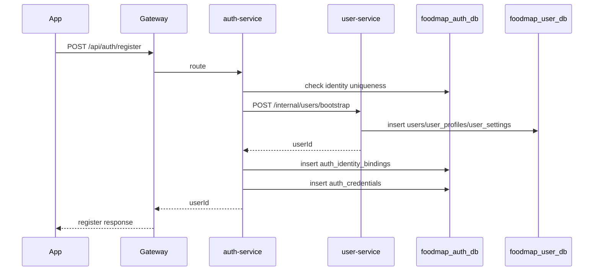
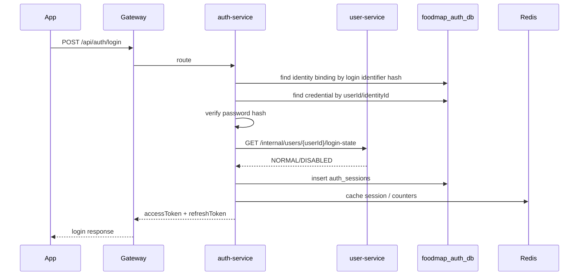
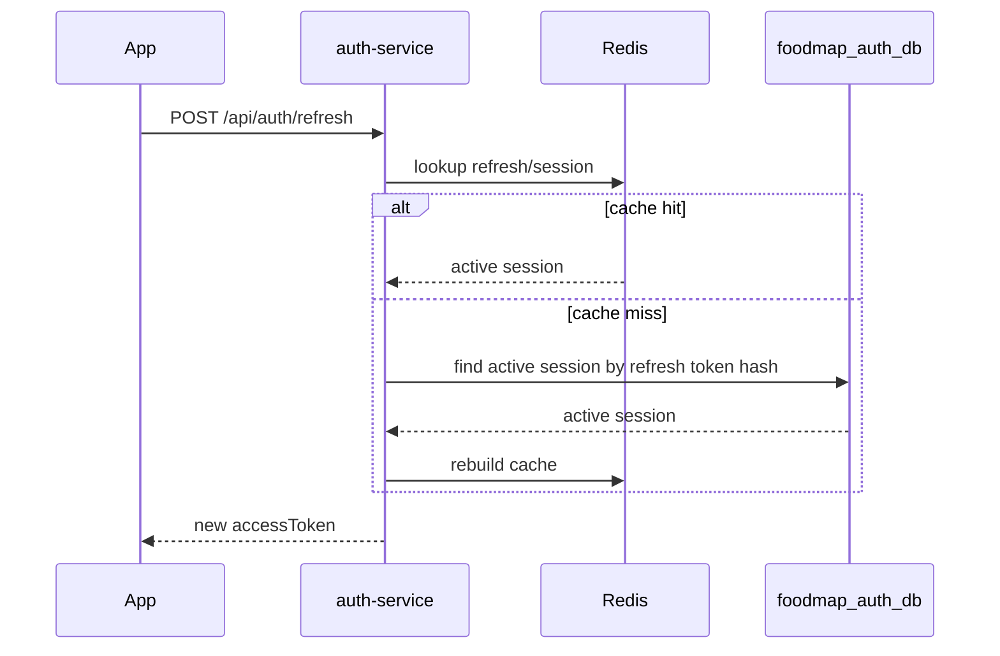
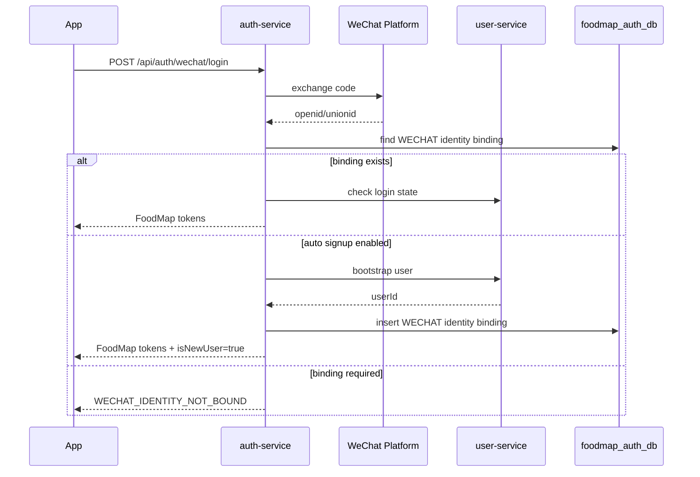

# FoodMap 身份与认证边界重构方案 v2

状态：方案说明，待确认后同步 `CODEX-after.md`、API 文档和代码。

日期：2026-06-29

## 1. 结论

推荐方案：

```text
保留 foodmap-auth-service。
取消 accountId 作为长期主体。
全系统只使用 userId 表示登录用户。
账号名、手机号、邮箱、微信、Apple 都作为 userId 下的登录身份绑定。
auth-service 管认证身份、凭证、会话和 Token。
user-service 管用户主体资料、展示状态和偏好设置。
登录审计长期进入 log-service，user-service 只保存必要用户活跃快照。
```

这版方案修正上一版中三个容易混淆的点：

- `auth_login_identities` 更名为 `auth_identity_bindings`，强调它是“登录身份绑定关系”，不是新主体。
- `auth_credentials` 必须落 DB；Refresh Token 不建议只放 Redis，建议升级为 `auth_sessions`，DB 保存事实，Redis 做热缓存和撤销加速。
- `auth_login_logs` 不应放入 user-service。长期应进入 `foodmap-log-service` 或安全审计库；user-service 只维护 `last_login_time`、`last_active_time` 等快照字段。

## 2. 当前问题

B1 认证联调阶段，项目已具备注册、登录、Token、当前用户查询和 iOS 主链路。但当前身份模型存在结构性问题：

```text
auth_accounts.account_id
users.user_id
```

这两个 ID 当前是一对一关系，并且都在描述同一个登录主体。实际产品语义里只有一个主体：FoodMap 用户。

由此产生的问题：

- 注册链路需要 auth-service 写 `auth_accounts/auth_credentials` 后再调用 user-service 写 `users/user_profiles/user_settings`。
- `/api/users/me` 需要同时校验 `accountId` 和 `userId`。
- 前端、Gateway、TokenClaims、日志里都要携带 `accountId + userId`。
- 后续接微信登录时，还会继续遇到“微信账号、认证账号、用户主体”三层概念混杂。

需要重构的不是“是否有 auth-service”，而是：

```text
account 不应该是和 user 平级的主体。
accountName/phone/email/wechat 都应该是 userId 下的登录身份。
```

## 3. 领域概念

### 3.1 User

FoodMap 用户主体。

系统内其他业务服务只引用：

```text
userId
```

适用场景：

- 推荐归属。
- 好友关系。
- 情侣关系。
- 评论归属。
- 可见范围判断。
- 当前用户资料查询。

### 3.2 Identity Binding

登录身份绑定。

它回答的问题是：

```text
这个登录标识属于哪个 userId？
```

示例：

```text
账号名 zhangsan        -> userId 200001
手机号 186****1693     -> userId 200001
邮箱 a***@qq.com       -> userId 200001
微信 unionid/openid    -> userId 200001
Apple sub              -> userId 200001
```

它不是账号主体，也不生成新的业务主体 ID。

### 3.3 Credential

登录凭证。

它回答的问题是：

```text
这个登录身份如何证明自己可信？
```

示例：

- 密码哈希。
- 短信验证码验证结果。
- 微信 code 换取 openid/unionid 后的服务端校验结果。
- Apple identity token 校验结果。

密码哈希属于长期认证事实，必须落 DB。

### 3.4 Session

登录会话。

它回答的问题是：

```text
这个用户当前有哪些可刷新登录态？
```

Access Token 可以是 JWT，不需要落库。

Refresh Token 对应的会话状态建议 DB + Redis：

- DB 保存长期事实、撤销、审计和多端会话。
- Redis 保存热路径查询、denylist、短期撤销状态和性能优化。

### 3.5 Profile

用户展示资料。

它回答的问题是：

```text
别人或自己看到的 FoodMap 用户资料是什么？
```

示例：

- 昵称。
- 头像。
- 城市。
- 简介。
- 隐私偏好。
- 是否允许被搜索。

这些归 user-service。

## 4. 服务边界

### 4.1 auth-service

保留 `foodmap-auth-service`。

职责：

- 管理登录身份绑定：账号名、手机号、邮箱、微信、Apple。
- 管理认证凭证：密码哈希、凭证状态、密码更新时间。
- 处理登录、刷新 Token、退出登录。
- 签发 FoodMap Access Token。
- 管理 Refresh Token 对应的会话状态。
- 处理第三方认证回调或 code 交换。
- 产生登录审计事件。
- 调用 user-service 校验用户是否允许登录。

不负责：

- 用户昵称、头像、城市、简介。
- 用户隐私设置。
- 好友、情侣、推荐、门店、社区。
- 用户展示资料搜索。

### 4.2 user-service

职责：

- 生成和维护 `userId`。
- 创建用户主体。
- 管理用户资料、扩展资料和默认设置。
- 管理用户展示状态，例如 NORMAL、DISABLED。
- 管理用户搜索偏好，例如是否允许手机号或邮箱搜索。
- 保存必要登录快照，例如 `last_login_time`、`last_active_time`。

不负责：

- 密码哈希。
- Refresh Token。
- 微信 openid/unionid 绑定事实。
- Access Token 签发。
- 完整登录安全审计。

### 4.3 gateway-service

职责：

- 校验 Access Token。
- 从 Token 中解析 `userId`。
- 覆盖外部伪造的 `X-FoodMap-*` 可信身份头。
- 向下游服务透传 `X-FoodMap-User-Id`。
- 阻断外部访问非健康类 `/internal/**`。

不再要求透传：

```text
X-FoodMap-Account-Id
```

### 4.4 log-service

长期职责：

- 保存登录审计日志。
- 保存接口访问摘要。
- 保存安全审计日志。
- 支持后台按 `requestId`、`traceId`、`userId` 查询。

auth-service 可以在过渡期保留轻量登录日志表，但长期应通过事件或日志管道进入 log-service。

## 5. 为什么登录身份放在 auth-service

账号名、手机号、邮箱如果只是展示资料，可以放 user-service。

但它们一旦能用于登录，就成为认证身份。认证身份参与以下闭环：

```text
输入登录标识 -> 定位 userId -> 校验凭证 -> 签发 Token -> 记录安全事件
```

放在 auth-service 的原因：

1. 登录链路闭合
   auth-service 可以独立完成“登录标识到 userId 的映射”和凭证校验，不需要每次先调用 user-service 查 userId。

2. 安全规则集中
   登录失败次数、账号锁定、凭证禁用、手机号换绑、邮箱验证、微信解绑最后身份校验，都属于认证安全规则。

3. 第三方登录自然
   微信登录时，auth-service 需要通过 openid/unionid 找到 userId。如果绑定关系在 user-service，认证判断会分裂到两个服务。

4. 敏感信息收口
   手机号、邮箱、openid、unionid 都是敏感标识。auth-service 可以统一做 hash、加密、脱敏和审计。

5. user-service 保持稳定
   user-service 只关心“用户资料是什么”，不承担“如何证明你是这个用户”。

如果把账号名、手机号、邮箱全部放到 user-service，也可以成立，但那意味着 user-service 实际变成 identity-service，auth-service 只剩 Token 签发组件。若采用该方向，应重新评估是否还需要独立 auth-service。

本方案不采用该方向。

## 6. 目标数据模型

### 6.1 user-service

#### users

用途：FoodMap 用户主体表。

| 字段名 | 类型 | 说明 |
| --- | --- | --- |
| user_id | bigint not null | 用户业务主键，全系统唯一用户主体 |
| nickname | varchar(64) not null | 用户昵称 |
| avatar_media_id | bigint | 头像媒体业务主键 |
| user_status | varchar(32) not null | 用户资料状态，如 NORMAL、DISABLED |
| searchable | smallint not null default 1 | 是否允许被搜索 |
| last_login_time | timestamptz | 最近登录成功时间快照，可选 |
| last_active_time | timestamptz | 最近活跃时间快照，可选 |
| created_time | timestamptz | 创建时间 |
| updated_time | timestamptz | 更新时间 |
| is_delete | smallint | 逻辑删除标记 |

调整点：

- 移除或废弃 `account_id`。
- `user_id` 由 user-service 生成。
- user-service 不保存完整手机号、完整邮箱、微信 openid/unionid。

#### user_profiles

继续保存用户展示资料：

- 城市。
- 简介。
- 性别。
- 生日。

#### user_settings

继续保存用户设置：

- 默认推荐可见范围。
- 是否允许好友申请。
- 是否允许通过手机号搜索。
- 是否允许通过邮箱搜索。

注意：`allow_search_by_phone/email` 是搜索偏好，不代表 user-service 必须保存完整手机号/邮箱。后续搜索能力可以通过 auth-service 受控内部查询、脱敏索引或独立搜索索引实现。

### 6.2 auth-service

#### auth_identity_bindings

用途：保存登录身份到 `userId` 的绑定关系。

| 字段名 | 类型 | 说明 |
| --- | --- | --- |
| identity_id | bigint not null | 登录身份绑定业务主键 |
| user_id | bigint not null | FoodMap 用户业务主键 |
| provider | varchar(32) not null | LOCAL、WECHAT、APPLE |
| identity_type | varchar(32) not null | ACCOUNT_NAME、PHONE、EMAIL、WECHAT_OPENID、WECHAT_UNIONID、APPLE_SUB |
| identity_hash | varchar(255) not null | 标准化登录标识哈希，用于唯一索引和检索 |
| identity_cipher | varchar(512) | 加密后的登录标识，可选 |
| display_masked | varchar(128) | 脱敏展示值，如 186****1693 |
| provider_subject | varchar(255) | 第三方平台主体 ID，如 openid 或 Apple sub |
| union_subject | varchar(255) | 第三方跨应用主体 ID，如微信 unionid |
| verified | smallint not null default 0 | 是否已验证 |
| primary_identity | smallint not null default 0 | 是否主登录身份 |
| identity_status | varchar(32) not null | NORMAL、DISABLED、UNBOUND |
| bound_time | timestamptz | 绑定时间 |
| created_time | timestamptz | 创建时间 |
| updated_time | timestamptz | 更新时间 |
| is_delete | smallint | 逻辑删除标记 |

唯一约束建议：

```text
uk_auth_identity_bindings_identity_hash_active(provider, identity_type, identity_hash)
uk_auth_identity_bindings_provider_subject_active(provider, provider_subject)
```

使用节点：

- 注册前检查账号名、手机号、邮箱是否已绑定。
- 登录时通过登录标识定位 userId。
- 微信登录时通过 openid/unionid 定位 userId。
- 绑定、解绑手机号、邮箱、微信。
- 安全设置页展示已绑定身份。
- 后台用户安全排查。

#### auth_credentials

用途：保存长期认证凭证。

| 字段名 | 类型 | 说明 |
| --- | --- | --- |
| credential_id | bigint not null | 凭证业务主键 |
| user_id | bigint not null | 用户业务主键 |
| identity_id | bigint | 关联登录身份绑定，可选 |
| credential_type | varchar(32) not null | PASSWORD、SMS_CODE、OAUTH_TEMP |
| password_hash | varchar(255) | 密码哈希，禁止保存明文密码 |
| hash_algorithm | varchar(64) | 哈希算法 |
| credential_status | varchar(32) not null | ACTIVE、DISABLED |
| password_updated_time | timestamptz | 密码更新时间 |
| created_time | timestamptz | 创建时间 |
| updated_time | timestamptz | 更新时间 |
| is_delete | smallint | 逻辑删除标记 |

结论：

```text
auth_credentials 必须落 DB。
Redis 不能作为密码哈希和长期凭证状态的唯一事实源。
```

可放 Redis 的认证临时数据：

- 短信验证码。
- 登录失败计数。
- OAuth state。
- 微信登录临时态。
- 短期风控标记。

#### auth_sessions

用途：替代 `auth_refresh_tokens`，保存 Refresh Token 对应的长期会话事实。

| 字段名 | 类型 | 说明 |
| --- | --- | --- |
| session_id | varchar(64) not null | 会话 ID |
| user_id | bigint not null | 用户业务主键 |
| refresh_token_hash | varchar(255) not null | Refresh Token 哈希 |
| device_type | varchar(32) | IOS、WEB、ADMIN |
| device_name | varchar(128) | 设备名称，可选 |
| expires_time | timestamptz not null | Refresh Token 过期时间 |
| revoked_time | timestamptz | 撤销时间 |
| session_status | varchar(32) not null | ACTIVE、REVOKED、EXPIRED |
| created_time | timestamptz | 创建时间 |
| updated_time | timestamptz | 更新时间 |
| is_delete | smallint | 逻辑删除标记 |

Redis 使用建议：

```text
foodmap:auth:session:v1:{sessionId}
foodmap:auth:refresh:v1:{refreshTokenHash}
foodmap:auth:denylist:v1:{jti}
```

结论：

```text
Access Token 不落库。
Refresh Token 不明文落库。
auth_sessions DB 保存长期会话事实。
Redis 保存热路径状态、denylist 和撤销加速。
不建议只用 Redis 保存 Refresh Token 状态，除非接受 Redis 丢失导致全员重新登录。
```

### 6.3 登录审计

不建议把完整登录日志放 user-service。

推荐长期模型：

```text
auth-service 产生 AuthLoginAuditEvent
log-service 保存 auth_login_audit_log
user-service 只更新 last_login_time / last_active_time 快照
```

登录审计字段建议：

| 字段名 | 说明 |
| --- | --- |
| audit_id | 审计业务主键 |
| user_id | 用户业务主键，失败且未匹配用户时可为空 |
| provider | LOCAL、WECHAT、APPLE |
| login_type | PASSWORD、WECHAT_CODE、REFRESH_TOKEN |
| login_result | SUCCESS、FAILED |
| failure_code | 失败码 |
| request_id | 请求 ID |
| trace_id | 链路 ID |
| ip_address_masked | 脱敏 IP |
| user_agent_summary | UA 摘要 |
| created_time | 创建时间 |

过渡期可选：

- auth-service 保留短期 `auth_login_logs` 表。
- 后续接入 log-service 后迁移为事件写入。

## 7. 目标 Token 和请求头

Token v2 claims：

```json
{
  "sub": "200001",
  "userId": 200001,
  "tokenType": "ACCESS",
  "sessionId": "s_abc",
  "expiresTime": "2026-06-29T20:00:00+08:00"
}
```

Gateway 下游标准头：

```text
X-FoodMap-User-Id
X-Request-Id
X-Trace-Id
```

废弃：

```text
accountId
X-FoodMap-Account-Id
```

过渡策略：

- B1 本地联调可要求用户重新登录，不兼容旧 Token。
- 如需兼容旧 Token，common 层临时支持 Token v1/v2 解析，但新业务代码不得继续依赖 `accountId`。

## 8. API 契约调整

### 8.1 外部路径保持稳定

继续保留：

```text
POST /api/auth/register
POST /api/auth/login
POST /api/auth/refresh
POST /api/auth/logout
GET  /api/users/me
```

原因：

- 前端改动小。
- Gateway 路由稳定。
- auth-service 仍是认证入口。

### 8.2 注册响应

目标响应：

```json
{
  "userId": 200001,
  "userStatus": "NORMAL"
}
```

不再返回：

```text
accountId
accountStatus
```

### 8.3 登录响应

目标响应：

```json
{
  "userId": 200001,
  "accessToken": "eyJhbGciOiJIUzI1NiJ9...",
  "refreshToken": "eyJhbGciOiJIUzI1NiJ9...",
  "accessTokenExpiresTime": "2026-06-29T20:00:00+08:00",
  "refreshTokenExpiresTime": "2026-07-29T20:00:00+08:00"
}
```

### 8.4 当前用户响应

目标响应：

```json
{
  "userId": 200001,
  "nickname": "小张",
  "avatarMediaId": 300001,
  "userStatus": "NORMAL"
}
```

账号名、手机号、邮箱如需展示，应通过安全设置接口返回脱敏信息，例如：

```text
GET /api/auth/identity-bindings
```

### 8.5 微信接口预留

```text
POST /api/auth/wechat/login
POST /api/auth/wechat/bind
POST /api/auth/wechat/unbind
```

微信登录响应：

```json
{
  "userId": 200001,
  "isNewUser": true,
  "accessToken": "eyJhbGciOiJIUzI1NiJ9...",
  "refreshToken": "eyJhbGciOiJIUzI1NiJ9...",
  "accessTokenExpiresTime": "2026-06-29T20:00:00+08:00",
  "refreshTokenExpiresTime": "2026-07-29T20:00:00+08:00"
}
```

未绑定错误：

```json
{
  "success": false,
  "status": 409,
  "code": "WECHAT_IDENTITY_NOT_BOUND",
  "message": "微信账号尚未绑定 FoodMap 用户",
  "data": null
}
```

## 9. 核心流程

### 9.1 密码注册



一致性要求：

- 登录身份唯一性先由 auth-service 判断。
- user-service 创建成功但 auth-service 写入失败时，短期需要补偿接口或失败状态。
- 长期使用 Saga / Outbox / 幂等重试，不使用强分布式事务作为默认方案。

### 9.2 密码登录



### 9.3 Refresh Token



### 9.4 微信登录



## 10. 代码重构范围

### 10.1 foodmap-common

调整：

- `TokenClaims` 移除或废弃 `accountId`。
- `CurrentUser` 移除或废弃 `accountId`。
- `CurrentUserResolver` 不再要求 `X-FoodMap-Account-Id`。
- `FoodMapAuthHeaders.ACCOUNT_ID` 标记 deprecated。
- `HmacTokenCodec` 支持 Token v2 claims。

### 10.2 foodmap-gateway-service

调整：

- `GatewayAuthFilter` 只从 Token 提取 `userId` 作为标准用户主体。
- 覆盖外部伪造 `X-FoodMap-User-Id`。
- 不再向下游标准透传 `X-FoodMap-Account-Id`。

### 10.3 foodmap-user-service

调整：

- `users.account_id` 废弃，后续迁移移除。
- `ProvisionUserRequest` 移除 `accountId`。
- 新增 `POST /internal/users/bootstrap`。
- 新增 `GET /internal/users/{userId}/login-state`。
- `/api/users/me` 只依赖 `X-FoodMap-User-Id`。
- `CurrentUserResponse` 移除 `accountId`。

### 10.4 foodmap-auth-service

调整：

- 移除 `AuthAccountEntity` 作为主体实体。
- 移除 `auth_user_id_seq`，auth-service 不再生成 userId。
- 新增 `AuthIdentityBindingEntity`。
- 调整 `AuthCredentialEntity` 以 `userId/identityId` 为核心关联。
- 新增 `AuthSessionEntity` 替代 RefreshTokenEntity 的长期模型。
- 注册用例：检查身份唯一性 -> 调 user-service bootstrap -> 写 identity bindings 和 credentials。
- 登录用例：按登录标识查 identity binding -> 校验 credential -> 签发 Token。
- 刷新用例：Redis 优先，DB 回源，支持撤销。
- 登录审计：产生事件，过渡期可写 auth 本地短期表。

### 10.5 foodmap-log-service

后续调整：

- 新增认证审计日志消费。
- 保存登录成功、登录失败、退出登录、连续失败、强制下线等事件。
- 查询时脱敏手机号、邮箱、Token、openid、unionid。

### 10.6 iOS 前端

调整：

- `LoginResponse`、`RegisterResponse`、`CurrentUserResponse` 不再依赖 `accountId`。
- 登录会话只保存 `userId`、Access Token、Refresh Token。
- Token v2 切换后要求重新登录或清理旧 Keychain token。

## 11. 数据迁移策略

### 11.1 本地 B1 数据

如果没有需要保留的真实用户数据，建议直接清理本地 auth/user 测试数据，按新模型重新注册。

这是成本最低、风险最低的方式。

### 11.2 需要保留数据时

迁移映射：

```text
auth_accounts.user_id -> auth_identity_bindings.user_id
auth_accounts.account_name -> auth_identity_bindings(provider=LOCAL, identity_type=ACCOUNT_NAME)
auth_accounts.phone -> auth_identity_bindings(provider=LOCAL, identity_type=PHONE)
auth_accounts.email -> auth_identity_bindings(provider=LOCAL, identity_type=EMAIL)
auth_credentials.account_id -> auth_accounts.account_id -> user_id -> auth_credentials.user_id
refresh_tokens.account_id -> auth_accounts.account_id -> user_id -> auth_sessions.user_id
users.account_id -> deprecated
```

迁移建议：

- 所有历史 Refresh Token 可直接失效，要求重新登录。
- 每个有效用户至少生成一条 LOCAL 登录身份。
- 手机号、邮箱进入 auth-service 前必须标准化、hash、必要时加密。
- 迁移后新 Token 不再包含 `accountId`。

## 12. 实施步骤

### 阶段 0：确认方案

确认：

- 保留 auth-service。
- 取消 accountId。
- `userId` 是唯一跨服务用户主体。
- 登录身份绑定归 auth-service。
- 登录审计长期归 log-service。
- Refresh Token 会话采用 DB + Redis。

### 阶段 1：文档基线同步

修改：

- `CODEX-after.md`
- `CODEX-gen.md`
- `docs/api/auth-user.md`
- `docs/integration/B1-auth-ios-backend/integration-plan.md`
- 必要时更新 `CODEX-front.md`

验收：

- 文档不再把 `auth_accounts` 作为长期目标主体表。
- API 文档明确 `accountId` deprecated。
- B1 联调安全点改为 userId-only。

### 阶段 2：common + gateway

实现 Token v2 和 Gateway 透传调整。

验收：

- Token claims 只要求 `userId`。
- Gateway 标准注入 `X-FoodMap-User-Id`。
- 外部伪造身份头会被覆盖。

### 阶段 3：user-service

实现 userId-only 用户主体创建和当前用户查询。

验收：

- `POST /internal/users/bootstrap` 可创建用户主体、资料和设置。
- `/api/users/me` 不再依赖 accountId。
- 用户禁用状态可供 auth-service 登录前校验。

### 阶段 4：auth-service

实现认证身份模型。

验收：

- 注册写入 `auth_identity_bindings/auth_credentials`。
- 登录按账号名、手机号、邮箱定位 userId。
- Refresh Token 写入 `auth_sessions`，Redis 作为缓存。
- 退出登录可撤销 session。
- 不再生成 `accountId`。

### 阶段 5：iOS 和联调

验收：

- 注册返回 userId。
- 登录返回 userId 和 Token。
- 登录后 `/api/users/me` 成功。
- iOS 不再依赖 accountId。

### 阶段 6：微信预留

验收：

- `AuthProvider.WECHAT`、身份绑定字段和错误码已定义。
- 微信未绑定、自动注册、绑定已有用户三种策略至少确认一种。
- 日志不输出完整 openid/unionid。

## 13. 验收清单

### 架构验收

- [ ] 全系统长期身份主键为 `userId`。
- [ ] 新 Token 不包含 `accountId`。
- [ ] 新 API 契约不返回 `accountId`。
- [ ] auth-service 不持有账号主体，只持有认证身份绑定、凭证和会话。
- [ ] user-service 负责用户主体资料和展示状态。
- [ ] 登录审计长期进入 log-service。

### 注册登录验收

- [ ] 账号名注册成功后可登录。
- [ ] 手机号注册成功后可登录。
- [ ] 邮箱注册成功后可登录。
- [ ] 重复账号名返回 409。
- [ ] 重复手机号返回 409。
- [ ] 重复邮箱返回 409。
- [ ] 密码错误返回 401。
- [ ] 用户禁用后不能登录。
- [ ] 注册成功后立即调用 `/api/users/me` 成功。

### 会话验收

- [ ] Access Token 不落库。
- [ ] Refresh Token 明文不落库。
- [ ] `auth_sessions` 保存 refresh token hash 和状态。
- [ ] Redis 缓存丢失后可从 DB 回源，或明确要求重新登录。
- [ ] Logout 后 Refresh Token 失效。

### 微信验收

- [ ] WECHAT 身份绑定唯一约束生效。
- [ ] 已绑定微信能映射到唯一 userId。
- [ ] 未绑定微信有稳定错误码。
- [ ] 微信 openid/unionid 不进入普通业务日志。

## 14. 待确认问题

1. 微信登录策略
   未绑定微信时，是自动创建新用户，还是要求先绑定已有账号。

2. 手机号/邮箱搜索策略
   是否允许通过手机号/邮箱搜索用户。如果允许，需要确定搜索由 auth-service 内部查询支持，还是生成脱敏搜索索引。

3. Redis 丢失策略
   Redis 丢失后，是允许 DB 回源恢复 session，还是强制所有 Refresh Token 失效。

4. 登录审计落地路径
   是先保留 auth-service 本地短期表，还是直接接入 log-service 消费认证审计事件。

5. 本地数据处理
   B1 本地数据是否可以清空重建。如果可以，迁移实现成本会明显降低。

## 15. 最终建议

当前阶段不建议继续在 `accountId + userId` 双主体模型上开发好友、情侣、推荐和社区能力。

建议先完成身份模型重构：

```text
userId-only
auth_identity_bindings
auth_credentials
auth_sessions
Gateway userId-only header
iOS userId-only session
```

完成后再继续推进后续业务服务。这样后面的权限、可见范围、好友关系、情侣关系和推荐归属都会更清晰。
