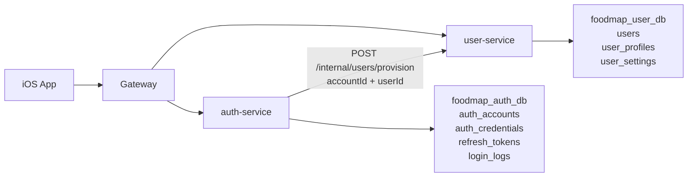
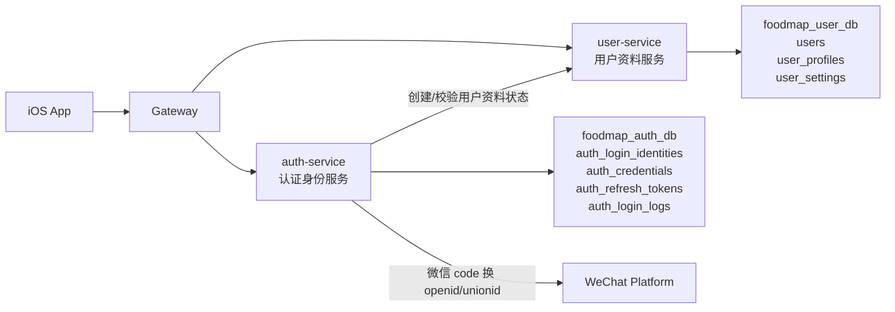
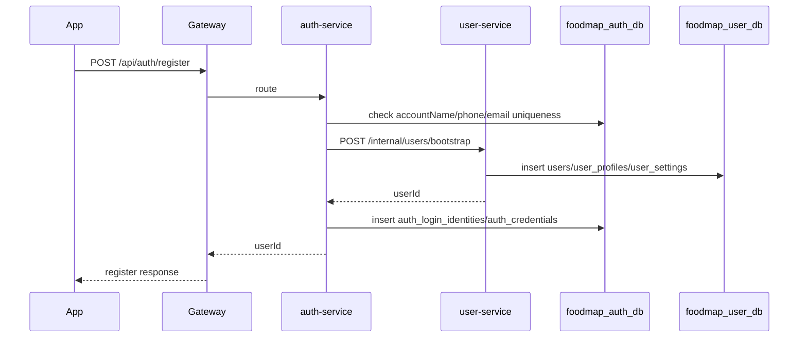
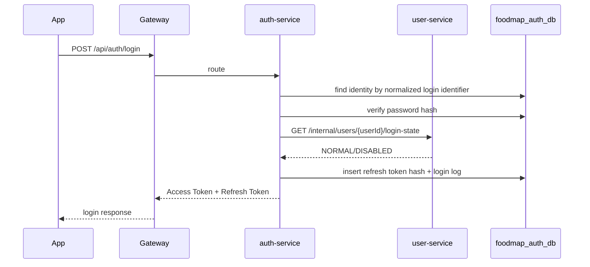
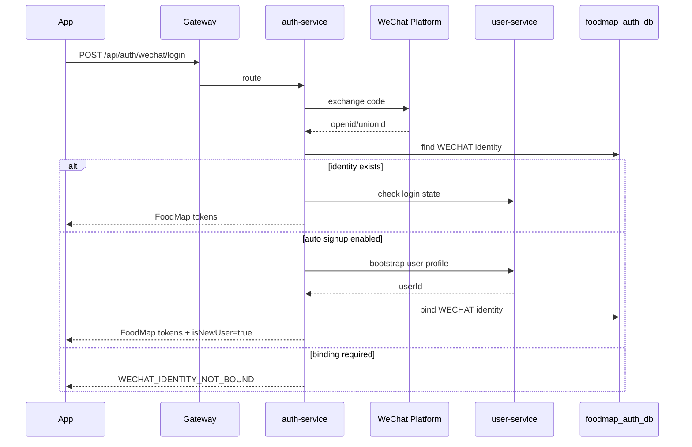

# FoodMap 身份与认证边界重构说明

状态：方案说明，待确认后进入 CODEX 文档和代码重构。

日期：2026-06-26

## 1. 背景

B1 认证联调阶段已经完成注册、登录、登录后进入地图页等主链路验证，但当前后端身份模型暴露出结构性问题：

- `foodmap-auth-service` 拥有 `auth_accounts.account_id`。
- `foodmap-user-service` 拥有 `users.user_id`。
- `auth_accounts` 和 `users` 是一对一关系，且双方都在描述同一个登录主体。
- 注册链路需要 auth 服务写账号和凭证后，再调用 user 服务开通用户资料。
- `/api/users/me` 需要同时校验 `accountId` 和 `userId`，否则可能出现身份串读风险。

这些问题不是简单的包名或 Feign 调用问题，而是身份域边界不清晰导致的系统复杂度。

## 2. 当前模型



当前核心数据关系：

```text
auth_accounts.account_id  <->  users.account_id
auth_accounts.user_id     <->  users.user_id
```

当前 Token 和请求头同时携带：

```text
accountId
userId
X-FoodMap-Account-Id
X-FoodMap-User-Id
```

## 3. 问题判断

### 3.1 双主体问题

`accountId` 和 `userId` 当前都是登录主体标识，但产品语义里只有一个真实主体：FoodMap 用户。

账号名、手机号、邮箱、微信身份本质上是用户的登录方式或登录凭证，不应该成为和用户平级的主体。

因此，长期模型里应只有一个跨服务身份主键：

```text
userId
```

### 3.2 auth-service 职责混淆

当前 `auth-service` 既负责认证能力，又持有 `auth_accounts` 这种主体表。这样会让 auth 服务看起来像“用户主服务”的一部分。

更合理的边界是：

- auth 服务负责登录身份、凭证、Token、Refresh Token、外部身份绑定和登录安全事件。
- user 服务负责用户资料、昵称、头像、城市、简介、隐私设置和用户展示状态。
- 其他业务服务只引用 `userId`。

### 3.3 是否取消 auth-service

不建议直接取消 auth-service。

原因：

- 后续需要支持微信、Apple 等第三方登录。
- 外部身份换取 FoodMap Token 的流程应集中在认证边界内。
- Refresh Token 撤销、登录日志、登录风控、Token 版本、第三方身份绑定都属于认证能力。

正确方向不是取消 auth-service，而是取消 `accountId` 这个平级主体，把 auth-service 重构为“认证身份服务”。

## 4. 重构目标

### 4.1 核心目标

1. 全系统只使用 `userId` 表示当前登录主体。
2. 移除 `accountId` 对外语义，不再作为 API、Token、Gateway 下游可信身份头的必要字段。
3. auth-service 保留，但不再持有 `auth_accounts` 这种主体表。
4. auth-service 只保存认证相关事实：登录身份、凭证、Refresh Token、登录日志、外部账号绑定。
5. user-service 继续作为用户资料和用户设置的事实来源。
6. 支持未来微信登录、微信绑定、解绑和同一用户多登录方式。

### 4.2 非目标

本次重构不解决以下问题：

- 不实现完整微信开放平台接入，只预留模型和接口边界。
- 不引入 OAuth2 Authorization Server 或第三方 IAM 平台。
- 不重构好友、情侣、推荐、社区等业务服务。
- 不调整地图、推荐、PUBLIC 统计等业务规则。
- 不把多个微服务合并成单体。

## 5. 推荐目标架构



目标请求身份：

```text
TokenClaims:
  sub/userId
  tokenType
  expiresTime
  tokenVersion 或 sessionId

Gateway 下游头：
  X-FoodMap-User-Id
  X-FoodMap-Account-Name 可选，仅显示或审计辅助，不作为主体
```

不再推荐：

```text
accountId
X-FoodMap-Account-Id
```

## 6. 服务边界

### 6.1 auth-service

保留服务名 `foodmap-auth-service`，短期不建议改名，避免 Maven 模块、Nacos 服务名、Gateway 路由和部署脚本同时变化。

职责：

- 账号名、手机号、邮箱登录身份管理。
- 密码凭证管理和密码哈希校验。
- 微信、Apple 等第三方身份绑定。
- 登录、刷新 Token、退出登录。
- Access Token 签发。
- Refresh Token 哈希保存和撤销。
- 登录日志和安全审计。
- 调用 user-service 校验用户是否允许登录。

不负责：

- 用户昵称、头像、城市、简介。
- 用户隐私设置。
- 好友、情侣、推荐、门店、社区数据。
- 用户展示资料搜索。

auth-service 可以有数据库，但数据库只能保存认证事实，不能再保存独立账号主体。

### 6.2 user-service

职责：

- 生成和维护 `userId`。
- 创建用户主记录、资料记录和默认设置。
- 查询和更新当前用户资料。
- 根据允许搜索字段搜索用户。
- 维护用户资料状态。

不负责：

- 密码哈希。
- Refresh Token。
- 微信 openid/unionid 绑定事实。
- Access Token 签发。

### 6.3 gateway-service

职责：

- 校验 Access Token 签名和过期时间。
- 从 Token 提取 `userId`。
- 覆盖外部传入的可信身份头。
- 向下游服务透传 `X-FoodMap-User-Id`。
- 阻断外部访问非健康类 `/internal/**`。

不再把 `accountId` 作为标准下游身份。

## 7. 数据模型设计

### 7.1 user-service 目标表

`users`

用途：保存 FoodMap 用户主体。

建议字段：

| 字段名 | 类型 | 说明 |
| --- | --- | --- |
| user_id | bigint not null | 用户业务主键，全系统唯一登录主体 |
| nickname | varchar(64) not null | 用户昵称 |
| avatar_media_id | bigint | 头像媒体业务主键 |
| user_status | varchar(32) not null | 用户资料状态，如 NORMAL、DISABLED |
| searchable | smallint not null default 1 | 是否允许被搜索 |
| created_time | timestamptz | 创建时间 |
| updated_time | timestamptz | 更新时间 |
| is_delete | smallint | 逻辑删除标记 |

调整点：

- 移除或废弃 `account_id` 字段。
- `user_id` 由 user-service 生成，auth-service 不再生成用户业务主键。

`user_profiles` 和 `user_settings` 继续保留，按 `user_id` 关联。

### 7.2 auth-service 目标表

#### auth_login_identities

用途：保存用户可用于登录的身份绑定，包括账号名、手机号、邮箱、微信、Apple。

| 字段名 | 类型 | 说明 |
| --- | --- | --- |
| identity_id | bigint not null | 登录身份业务主键 |
| user_id | bigint not null | FoodMap 用户业务主键 |
| provider | varchar(32) not null | 身份提供方，如 LOCAL、WECHAT、APPLE |
| identity_type | varchar(32) not null | 身份类型，如 ACCOUNT_NAME、PHONE、EMAIL、WECHAT_OPENID、WECHAT_UNIONID |
| identity_hash | varchar(255) not null | 标准化身份标识哈希，用于唯一索引和检索 |
| identity_cipher | varchar(512) | 加密后的身份标识，按安全要求可选保存 |
| provider_subject | varchar(255) | 第三方平台主体 ID，如 openid 或 Apple sub |
| union_subject | varchar(255) | 第三方跨应用主体 ID，如微信 unionid |
| verified | smallint not null default 0 | 是否已验证 |
| identity_status | varchar(32) not null | NORMAL、DISABLED、UNBOUND |
| bound_time | timestamptz | 绑定时间 |
| created_time | timestamptz | 创建时间 |
| updated_time | timestamptz | 更新时间 |
| is_delete | smallint | 逻辑删除标记 |

唯一约束建议：

```text
uk_auth_login_identities_provider_subject_active(provider, provider_subject) where is_delete = 0 and provider_subject is not null
uk_auth_login_identities_identity_hash_active(provider, identity_type, identity_hash) where is_delete = 0
```

说明：

- 手机号、邮箱、账号名不建议明文参与唯一索引。
- 日志中不能输出完整手机号、完整邮箱、微信 openid/unionid。

#### auth_credentials

用途：保存登录凭证。

| 字段名 | 类型 | 说明 |
| --- | --- | --- |
| credential_id | bigint not null | 凭证业务主键 |
| user_id | bigint not null | 用户业务主键 |
| identity_id | bigint | 登录身份业务主键，密码凭证可绑定到 LOCAL 身份 |
| credential_type | varchar(32) not null | PASSWORD、SMS_CODE、OAUTH_TEMP |
| password_hash | varchar(255) | 密码哈希 |
| hash_algorithm | varchar(64) | 哈希算法 |
| credential_status | varchar(32) not null | ACTIVE、DISABLED |
| created_time | timestamptz | 创建时间 |
| updated_time | timestamptz | 更新时间 |
| is_delete | smallint | 逻辑删除标记 |

#### auth_refresh_tokens

用途：保存 Refresh Token 哈希和撤销状态。

| 字段名 | 类型 | 说明 |
| --- | --- | --- |
| token_id | bigint not null | Refresh Token 业务主键 |
| user_id | bigint not null | 用户业务主键 |
| token_hash | varchar(255) not null | Refresh Token 哈希 |
| session_id | varchar(64) | 会话 ID，用于多端会话管理 |
| expires_time | timestamptz not null | 过期时间 |
| revoked_time | timestamptz | 撤销时间 |
| token_status | varchar(32) not null | ACTIVE、REVOKED、EXPIRED |
| created_time | timestamptz | 创建时间 |
| updated_time | timestamptz | 更新时间 |
| is_delete | smallint | 逻辑删除标记 |

#### auth_login_logs

用途：记录登录审计。

| 字段名 | 类型 | 说明 |
| --- | --- | --- |
| login_log_id | bigint not null | 登录日志业务主键 |
| user_id | bigint | 用户业务主键，失败且未匹配用户时为空 |
| provider | varchar(32) | LOCAL、WECHAT、APPLE |
| login_type | varchar(32) | PASSWORD、WECHAT_CODE、REFRESH_TOKEN |
| login_result | varchar(32) | SUCCESS、FAILED |
| failure_code | varchar(64) | 失败码 |
| ip_address | varchar(64) | 脱敏或受控保存的 IP |
| user_agent | varchar(512) | User-Agent |
| created_time | timestamptz | 创建时间 |
| updated_time | timestamptz | 更新时间 |
| is_delete | smallint | 逻辑删除标记 |

## 8. API 契约调整

### 8.1 保持外部路径稳定

前端外部路径尽量不变：

```text
POST /api/auth/register
POST /api/auth/login
POST /api/auth/refresh
POST /api/auth/logout
GET  /api/users/me
```

原因：

- 前端联调成本低。
- Gateway 路由无需大范围变化。
- auth-service 仍是认证入口。

### 8.2 注册响应调整

当前响应：

```json
{
  "accountId": 100001,
  "userId": 200001,
  "accountStatus": "NORMAL"
}
```

目标响应：

```json
{
  "userId": 200001,
  "userStatus": "NORMAL"
}
```

过渡期可以保留：

```json
{
  "accountId": null,
  "userId": 200001,
  "accountStatus": null,
  "userStatus": "NORMAL"
}
```

但新前端模型不应继续依赖 `accountId`。

### 8.3 登录响应调整

当前响应包含：

```text
accountId
userId
accessToken
refreshToken
```

目标响应：

```json
{
  "userId": 200001,
  "accessToken": "eyJhbGciOiJIUzI1NiJ9...",
  "refreshToken": "eyJhbGciOiJIUzI1NiJ9...",
  "accessTokenExpiresTime": "2026-06-26T20:00:00+08:00",
  "refreshTokenExpiresTime": "2026-07-26T20:00:00+08:00"
}
```

### 8.4 当前用户响应调整

当前响应：

```json
{
  "userId": 200001,
  "accountId": 100001,
  "accountName": "foodie_01",
  "nickname": "小张",
  "avatarMediaId": 300001,
  "userStatus": "NORMAL"
}
```

目标响应：

```json
{
  "userId": 200001,
  "nickname": "小张",
  "avatarMediaId": 300001,
  "userStatus": "NORMAL"
}
```

如产品需要展示账号名，应通过用户展示资料或安全设置接口返回脱敏信息，不应把 `accountId` 作为资料字段返回。

### 8.5 微信登录接口预留

建议新增：

```text
POST /api/auth/wechat/login
POST /api/auth/wechat/bind
POST /api/auth/wechat/unbind
```

微信登录请求：

```json
{
  "code": "wx-code-from-ios",
  "registeredChannel": "IOS"
}
```

微信登录响应：

```json
{
  "userId": 200001,
  "isNewUser": true,
  "accessToken": "eyJhbGciOiJIUzI1NiJ9...",
  "refreshToken": "eyJhbGciOiJIUzI1NiJ9...",
  "accessTokenExpiresTime": "2026-06-26T20:00:00+08:00",
  "refreshTokenExpiresTime": "2026-07-26T20:00:00+08:00"
}
```

如果业务要求微信必须绑定已有账号，可以返回：

```json
{
  "success": false,
  "status": 409,
  "code": "WECHAT_IDENTITY_NOT_BOUND",
  "message": "微信账号尚未绑定 FoodMap 用户",
  "data": null
}
```

## 9. 关键业务流程

### 9.1 密码注册

推荐 B1 重构后的同步流程：



失败处理：

- 如果登录标识已存在，直接返回 `409 CONFLICT`，不调用 user-service。
- 如果 user-service 创建失败，auth-service 不写认证身份和凭证。
- 如果 user-service 创建成功但 auth-service 写凭证失败，短期调用 user-service 内部补偿接口标记注册失败；长期使用 Saga + Outbox。

### 9.2 密码登录



说明：

- B1/B2 可同步调用 user-service 校验用户状态。
- 后续可通过用户状态变更事件同步 `login_enabled` 快照，减少登录链路跨服务调用。

### 9.3 微信登录



## 10. 代码重构范围

### 10.1 foodmap-common

需要调整：

- `TokenClaims` 移除或废弃 `accountId`。
- `CurrentUser` 移除或废弃 `accountId`。
- `CurrentUserResolver` 不再要求 `X-FoodMap-Account-Id`。
- `FoodMapAuthHeaders` 标记 `ACCOUNT_ID` 为 deprecated，新增迁移注释。
- `HmacTokenCodec` 支持 Token v2 claims。

建议兼容策略：

- 短期支持 v1/v2 Token 解析。
- Gateway 对 v1 Token 仍可透传 `accountId`，但新接口不依赖。
- B1 本地联调可以直接强制重新登录，清理旧 Token。

### 10.2 foodmap-gateway-service

需要调整：

- `GatewayAuthFilter` 从 Token 提取 `userId`。
- 覆盖外部伪造的 `X-FoodMap-*` 头。
- 标准透传 `X-FoodMap-User-Id`。
- `X-FoodMap-Account-Id` 只作为兼容字段或移除。

验收：

- 外部请求携带伪造 `X-FoodMap-User-Id` 时，Gateway 必须覆盖为 Token 中的 userId。
- 无 Token 访问受保护接口返回 401。
- 普通用户 Token 不能访问 `/api/admin/**`。

### 10.3 foodmap-auth-service

需要调整：

- 移除 `AuthAccountEntity` 作为主体实体。
- 移除 `auth_user_id_seq`，auth-service 不再生成 userId。
- 新增登录身份、凭证、Refresh Token、登录日志实体和 Mapper。
- 注册用例先检查身份唯一性，再调用 user-service 创建用户主体。
- 登录用例按登录身份查找 `userId`，校验密码或第三方身份后签发 Token。
- Feign 客户端从“用户资料开通”改为“用户主体创建/登录状态校验”。
- 注册、登录、刷新、退出响应 DTO 去除 `accountId`。

建议包结构：

```text
com.foodmap.auth
├── controller
├── service
├── service.impl
├── domain
│   ├── AuthProvider
│   ├── LoginIdentityType
│   ├── CredentialType
│   └── IdentityStatus
├── application
│   ├── registration
│   ├── login
│   └── wechat
├── application.port
├── infrastructure.client.user
├── infrastructure.client.wechat
└── infrastructure.persistence
```

### 10.4 foodmap-user-service

需要调整：

- `ProvisionUserRequest` 移除 `accountId`。
- `users.account_id` 标记废弃，后续迁移移除。
- 新增内部用户创建接口，例如 `POST /internal/users/bootstrap`。
- 新增内部登录状态接口，例如 `GET /internal/users/{userId}/login-state`。
- `/api/users/me` 只校验 `X-FoodMap-User-Id`。
- `CurrentUserResponse` 移除 `accountId`，`accountName` 仅在有明确展示需求时保留脱敏字段。

### 10.5 iOS 前端

需要调整：

- `LoginResponse`、`RegisterResponse`、`CurrentUserResponse` 模型移除或兼容 `accountId`。
- 登录成功后只以 `userId` 和 token 建立会话。
- Keychain 中旧 token 需要在 claims v2 切换后清理或重新登录。
- 调用路径保持 Gateway `http://127.0.0.1:18080`。

## 11. 数据迁移策略

### 11.1 本地开发环境

如果确认还没有需要保留的真实用户数据，本地可以采用低成本策略：

1. 创建新表。
2. 调整代码写新表。
3. 清理本地测试数据后重新注册。

不建议在本地继续维护 `accountId` 兼容逻辑过久。

### 11.2 已有数据迁移

如需要保留现有 B1 数据，迁移规则如下：

```text
auth_accounts.user_id -> auth_login_identities.user_id
auth_accounts.account_name -> auth_login_identities(provider=LOCAL, identity_type=ACCOUNT_NAME)
auth_accounts.phone -> auth_login_identities(provider=LOCAL, identity_type=PHONE)
auth_accounts.email -> auth_login_identities(provider=LOCAL, identity_type=EMAIL)
auth_credentials.account_id -> 通过 auth_accounts.account_id 映射到 user_id
refresh_tokens.account_id -> 通过 auth_accounts.account_id 映射到 user_id
login_logs.account_id -> 通过 auth_accounts.account_id 映射到 user_id
users.account_id -> deprecated/null
```

迁移后检查：

- 每个已有 `users.user_id` 至少有一条 LOCAL 登录身份。
- 每个密码凭证能映射到 `user_id`。
- Refresh Token 可以选择全部失效，要求用户重新登录。
- 新 Token 不再包含 `accountId`。

## 12. 推荐实施步骤

### 阶段 0：方案确认

输出和确认本文档。

验收：

- 确认保留 `foodmap-auth-service`。
- 确认取消 `accountId` 作为长期身份。
- 确认 `userId` 是唯一跨服务用户主体。
- 确认微信登录按 auth-service 认证边界预留。

### 阶段 1：文档基线同步

修改：

- `CODEX-after.md`
- `CODEX-gen.md`
- `docs/api/auth-user.md`
- `docs/integration/B1-auth-ios-backend/integration-plan.md`
- 必要时更新 `CODEX-front.md`

验收：

- 文档不再把 `auth_accounts` 描述为长期目标主体表。
- API 文档明确 `accountId` deprecated。
- B1 联调安全点改为 userId-only 身份模型。

### 阶段 2：common 和 gateway 身份 claims v2

修改：

- `foodmap-common`
- `foodmap-gateway-service`

验收：

- Token v2 只要求 userId。
- Gateway 注入 `X-FoodMap-User-Id`。
- 旧 Token 处理策略明确：兼容或要求重新登录。

### 阶段 3：user-service 用户主体创建接口

修改：

- `foodmap-user-service`

验收：

- `POST /internal/users/bootstrap` 能创建 `users/user_profiles/user_settings`。
- `GET /internal/users/{userId}/login-state` 能返回登录所需状态。
- `/api/users/me` 不再依赖 `accountId`。

### 阶段 4：auth-service 新认证身份模型

修改：

- `foodmap-auth-service`

验收：

- 新表和 Mapper 落地。
- 注册写入 `auth_login_identities/auth_credentials`。
- 登录按 accountName/phone/email 查询身份并签发 userId-only Token。
- Refresh Token 按 userId 保存和撤销。
- 登录日志按 userId 保存。

### 阶段 5：iOS 模型和联调调整

修改：

- `front/FoodMapApp`
- 联调文档

验收：

- 注册成功返回 userId。
- 登录成功返回 userId 和 Token。
- 登录后 `/api/users/me` 成功。
- 前端不依赖 accountId。

### 阶段 6：微信登录预留或首版实现

可先只落模型和接口占位，后续接入真实微信 SDK 和微信服务端接口。

验收：

- `AuthProvider.WECHAT`、微信身份表字段和错误码已定义。
- 微信未绑定和自动注册策略有明确产品决定。
- 日志不输出完整 openid/unionid。

## 13. 验收清单

### 13.1 架构验收

- [ ] 全系统长期身份主键为 `userId`。
- [ ] 新 Token 不包含 `accountId`。
- [ ] Gateway 标准下游身份头只要求 `X-FoodMap-User-Id`。
- [ ] `accountId` 不再出现在新增 API 契约中。
- [ ] auth-service 保留认证事实持久化，但不持有账号主体。
- [ ] user-service 负责用户主体和资料。

### 13.2 注册登录验收

- [ ] 账号名注册成功后可登录。
- [ ] 手机号注册成功后可登录。
- [ ] 邮箱注册成功后可登录。
- [ ] 重复账号名返回 409。
- [ ] 重复手机号返回 409。
- [ ] 重复邮箱返回 409。
- [ ] 密码错误返回 401。
- [ ] 用户禁用后不能登录。
- [ ] 注册成功后立即调用 `/api/users/me` 成功。

### 13.3 Token 验收

- [ ] Access Token claims 中 userId 正确。
- [ ] Refresh Token 只保存哈希。
- [ ] Logout 后 Refresh Token 失效。
- [ ] 过期 Access Token 返回 401。
- [ ] Gateway 覆盖外部伪造身份头。

### 13.4 微信预留验收

- [ ] 可保存 WECHAT 身份绑定。
- [ ] WECHAT 身份唯一约束生效。
- [ ] 未绑定微信账号有稳定错误码。
- [ ] 已绑定微信账号可映射到唯一 userId。

### 13.5 文档和联调验收

- [ ] `CODEX-after.md`、`docs/api/auth-user.md`、`CODEX-front.md` 无身份模型冲突。
- [ ] B1/B2 联调文档说明 accountId 迁移状态。
- [ ] iOS 模型与后端 DTO 字段一致。
- [ ] harness 校验通过。

## 14. 风险和处理

### 14.1 短期改动面较大

影响范围包括 common、gateway、auth、user、iOS、API 文档和联调文档。

处理：

- 先做文档基线。
- 再做 common/gateway。
- 最后做服务和前端联调。

### 14.2 注册仍然跨 auth-service 和 user-service

保留 auth-service 后，注册一定涉及“创建用户主体”和“创建认证身份”两个服务。

处理：

- B1/B2 阶段可使用同步调用 + 明确补偿。
- 后续稳定后使用 Outbox / Saga / 幂等任务。
- 禁止使用强分布式事务作为默认方案。

### 14.3 用户状态归属需要明确

用户禁用既影响资料展示，也影响登录。

处理：

- user-service 作为用户状态事实来源。
- auth-service 登录时同步查询 user-service。
- 后续可通过事件同步登录状态快照。

### 14.4 手机号和邮箱既是登录标识又可能用于搜索

手机号和邮箱属于敏感信息。

处理：

- auth-service 保存登录标识哈希和必要密文。
- user-service 不直接保存完整手机号/邮箱，除非有明确产品和安全设计。
- 搜索能力可后续通过内部受控查询或脱敏索引设计实现。

## 15. 结论

推荐方案：

```text
保留 foodmap-auth-service。
重构 auth-service 为认证身份服务。
取消 accountId 长期主体地位。
全系统只以 userId 表示登录用户。
账号名、手机号、邮箱、微信账号都作为 userId 下的登录身份。
```

这条路线同时满足：

- 用户提出的“账号是用户子属性”的判断。
- 后续微信登录、账号绑定和多登录方式扩展。
- 微服务独立数据库和服务边界约束。
- B1 之后继续推进关系、推荐、地图等业务功能所需的清晰身份模型。

